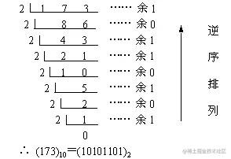
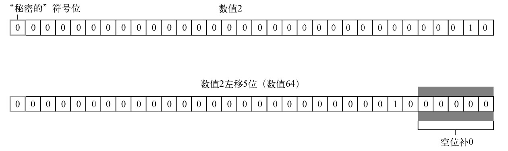
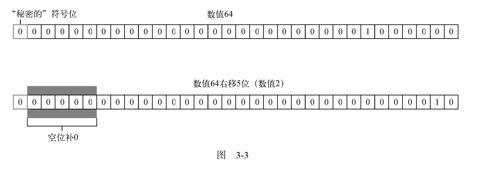

# 位操作符

## 十进制整数转换为二进制

- **通过除以 2 求余法进行转换：**
  - 从十进制数开始，通过重复地除以 2 并记录余数，可以得到其对应的二进制数。
- **具体步骤:**
  - **步骤 1:** 将要转换的十进制数除以 2，记录商和余数。
  - **步骤 2:** 用上一步的商继续除以 2，再次记录商和余数。
  - **步骤 3:** 重复这个过程，直到商为 0。
  - **步骤 4:** 将每次记录的余数从下往上排列，得到的数字序列就是对应的二进制数。



## 负数转换为二进制

负值以一种称为**`二补数`**(或补码)的二进制编码存储

- **确定负数的绝对值的二进制表示:**
  - 首先，找到改负数的绝对值的二进制表示。这与正整数的转换相同
- **求反码**
  - **取绝对值:** 将负数转换为其绝对值的二进制表示。
  - **取反码:** 将绝对值的二进制数中的每一位取反（0 变为 1，1 变为 0）。
  - **加 1:**

基于上述步骤确定`-18` 的二进制表示，首先从 `18` 的二进制开始

```javaScript
0000 0000 0000 0000 0000 0000 0001 0010
```

然后，计算一补数,即反转每一位的二进制值:

```javaScript
1111 1111 1111 1111 1111 1111 1110 1101
```

最后，给一补数加 1

```javaScript
1111 1111 1111 1111 1111 1111 1110 1110
```

## 浮点数转换为二进制

- 整数部分的转换和十进制正整数转换成二进制相同
- 小数部分的二进制转换:
  - 将小数部分乘以 `2`,记录整数部分作为二进制的一位,然后取剩余的小数部分再乘以 `2`,依此类推
  - 这样得到的整数部分就是小数点之后的二进制位。

例如，将十进制数 `0.625` 转换为二进制：

```javaScript
0.625 × 2 = 1.25  // 整数部分为 1
0.25 × 2 = 0.5    // 整数部分为 0
0.5 × 2 = 1.0     // 整数部分为 1

// 所以，0.625 的二进制表示为 0.101。
```

- 合并整数部分和小数部分
  - 将整数部分和小数部分的二进制表示拼接起来，用一个小数点分隔。

例如,`13.625` 的二进制表示为 `1101.101`。

## 按位非

`按位非`操作符用波浪符(`~`)表示，他的作用是返回数值的`反码`

```javaScript
let num1 = 25;  // 二进制 00000000000000000000000000011001
let num2 = ~num1; // 二进制 11111111111111111111111111100110
console.log(num2); // -26
```

这里，`按位非`操作符用到了数值 `25`,得到了结果是 `-26`。由此可以看出，`按位非`得最终效果是对数值取反并且减一。
就像执行如下操作得结果一样:

```javaScript
let num1 = 25;
let num2 = -num1 - 1;
console.log(num2); // -26
```

## 按位与

`按位与`操作符用`AND符号`(`&`)表示, 有两个操作数。

本质上，`按位与`就是将两个数的每一位对齐,然后基于下表的规则，对每一位执行相应的与操作

| 第一个数值的位 | 第二个数值的位 | 结果 |
| -------------- | -------------- | ---- |
| 1              | 1              | 1    |
| 1              | 0              | 0    |
| 0              | 0              | 0    |
| 0              | 1              | 0    |

`按位与`操作在两个位都是 1 时返回 1,在任何一位是 0 时返回 0。

```javaScript
let num1 = 25;
let num2 = 3;
console.log(num1&num2); // 1
```

为什么 25 和 3 按位于的操作结果是 1,看下面的二进制计算过程:

25 = 0000 0000 0000 0000 0000 0000 0001 1001

3 = 0000 0000 0000 0000 0000 0000 0000 0011

=============================================

AND = 0000 0000 0000 0000 0000 0000 0000 0001

## 按位或

`按位或`操作符用管道符(`|`)表示, 有两个操作数。

本质上，`按位或`就是将两个数的每一位对齐,然后基于下表的规则，对每一位执行相应的或操作

| 第一个数值的位 | 第二个数值的位 | 结果 |
| -------------- | -------------- | ---- |
| 1              | 1              | 1    |
| 1              | 0              | 1    |
| 0              | 0              | 0    |
| 0              | 1              | 1    |

`按位或`操作用在 至少一位是 1 时返回 1，两位都是 0 时返回 0

```javaScript
let num1 = 25;
let num2 = 3;
console.log(num1|num2) //27;
```

为什么 25 和 3 按位于的操作结果是 27 ,看下面的二进制计算过程:

25 = 0000 0000 0000 0000 0000 0000 0001 1001

3 = 0000 0000 0000 0000 0000 0000 0000 0011

=============================================

OR = 0000 0000 0000 0000 0000 0000 0001 1011

## 按位异或

`按位异或`操作符用`XOR符号`(`^`)表示, 有两个操作数。

下面是按位异或的真值表：

| 第一个数值的位 | 第二个数值的位 | 结果 |
| -------------- | -------------- | ---- |
| 1              | 1              | 0    |
| 1              | 0              | 1    |
| 0              | 0              | 0    |
| 0              | 1              | 1    |

`按位异或`和`按位或`的区别，它只在一位的是 1 的时候返回 1(两位都是 1 或者 0 返回 0)

```javaScript
let num1 = 25;
let num2 = 3;
console.log(num1^num2) ///26
```

为什么 25 和 3 按位于的操作结果是 26 ,看下面的二进制计算过程:

25 = 0000 0000 0000 0000 0000 0000 0001 1001

3 = 0000 0000 0000 0000 0000 0000 0000 0011

XOR = 0000 0000 0000 0000 0000 0000 0001 1010

## 左移

`左移`操作符用两个大于号`(<<)`,会将数值的所有 `32位` 都向右移

```javaScript
let oldValue = 2; // 等于二进制 10
let newValue = oldValue << 5; // 等于二进制 1000000，即十进制 64
```



## 有符号右移

`有符号右移`操作符用两个小于号`(>>)`,会将数值的所有 `32位` 都向右移，同时保留符号（正或负）

```javaScript
let oldValue = 64; // 等于二进制 1000000
let newValue = oldValue >> 5; // 等于二进制 10，即十进制 2
```



## 无符号右移

`无符号右移`操作符用两个大于号`(>>>)`,会将数值的所有 `32位` 都向右移

对于正数，`无符号右移`与`有符号右移`结果相同。仍然以前面`有符号右移`的例子为例

```javaScript
let oldValue = 64; // 等于二进制 1000000
let newValue = oldValue >>> 5; // 等于二进制 10，即十进制 2
```

对于负数，有时候差异会非常大。于`有符号右移`不同。`无符号右移`操作符将负数的二进制表示当成正数的二进制表示处理。

因为负数是其绝对值的二补数。所以右移之后结果变的非常大

```javaScript
let oldValue = -64 // 等于二进制 11111111111111111111111111000000
let newValue = oldValue >>> 5; // 等于二进制 00000111111111111111111111111110 即十进制 134217726
```
