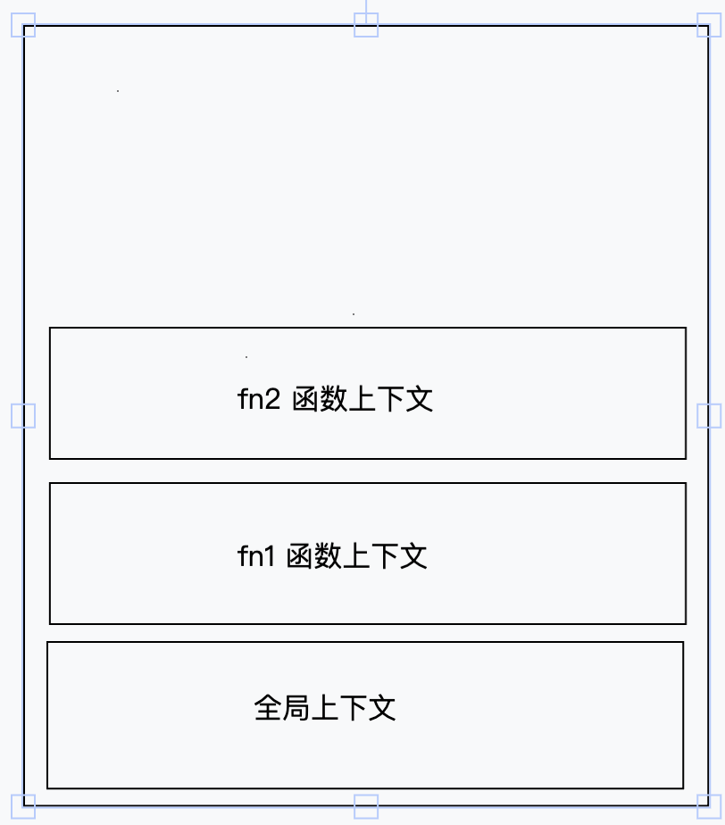

# 执行上下文

`执行上下文`以下简称`(上下文)`。

## 什么是上下文

即`变量`和`函数`的`上下文`决定了它们可以访问哪些数据,以及它们的行为。

### 上下文的组成

```javascript
const ExecutionContextObj = {
  VariableObject: window, // 变量对象
  ScopeChain: {}, // 作用域链
  this: window,
};
```

- **this**:执行上下文中 `this` 的指向，根据调用方式不同而不同。
- **变量对象**: 用于存储变量和`函数声明`，包括`函数参数`和`内部变量`。
- **作用域链**: 确保可以访问到的变量的顺序，即当前`上下文`的变量对象和外部上下文的变量对象。

## 上下文的类型

`上下文`的类型分为三种:

- **全局上下文**:
  - 在浏览器中,`全局上下文`就是 `window` 对象。
  - 所有通过`var`定义的全局变量和函数, 都会成为 `window` 对象属性方法。
  - 使用`let`和`const`创建的顶级声明则不会定义在`全局上下文`中。
  - 在应用程序退出前才会被销毁,(比如关闭网页,或者退出浏览器)
- **函数上下文**:
  - 当函数被**调用时**创建,会为该函数创建一个新的`上下文`。
  - 每一个**函数**都会有自己的上下文。
- **eval 上下文**
  - 指的是运行在 `eval` 函数中的代码，很少用而且不建议使用

## 执行栈

**执行栈**，也叫调用栈，被用来存储代码运行时创建的所有`上下文`。

:::info
栈：一种数据结构，遵循**后进先出**的原则
:::

```javascript
function fn1() {
  console.log("fn1被调用了 -- 创建了fn1的函数执行上下文,压入栈");
  fn2();
  console.log("fn2执行完成,fn2的执行上下文会从栈中弹出");
}

function fn2() {
  console.log("fn2被调用了 -- 创建了fn2的函数执行上下文,压入栈");
}

fn1();
console.log("fn1执行完成,fn2的执行上下文会从栈中弹出");
```



运行结果：

```
fn1被调用了 -- 创建了fn1的函数执行上下文,压入栈
fn2被调用了 -- 创建了fn2的函数执行上下文,压入栈
fn2执行完成,fn2的执行上下文会从栈中弹出
fn1执行完成,fn2的执行上下文会从栈中弹出
```

上述代码的执行上下文栈：

- 当上述代码在浏览器加载时, `JavaScript 引擎`创建了一个`全局执行上下文`并把它压入栈中
- 当函数 `fn1()` 被调用时, `JavaScript 引擎` 为该函数创建了一个`函数执行上下文`，并把它压入当前`执行栈`的顶部。
- 当 `fn1()函数` 内部调用 `fn2()函数` 时,`JavaScript 引擎` 同样创建了 `fn2()` 的`函数执行上下文`并`执行栈`的顶部。
- 然后执行完毕 `fn2()函数` 后, `fn2()函数`会从当前**栈（后进先出结构**）弹出，并且按程序执行顺序继续执行 `fn1()函数`。
- 当 `fn1()函数` 执行完毕,它的`执行上下文`从栈弹出,控制流程到达`全局执行上下文`。
- 一旦所有代码执行完毕,`JavaScript 引擎`从当前栈中移除全局执行上下文。
