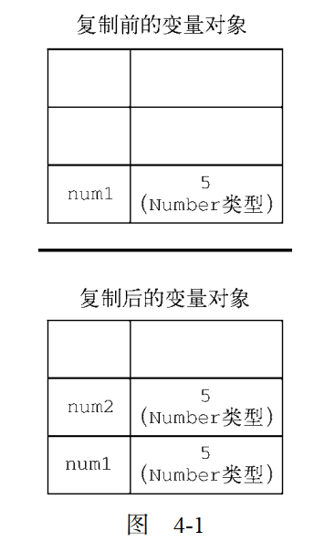
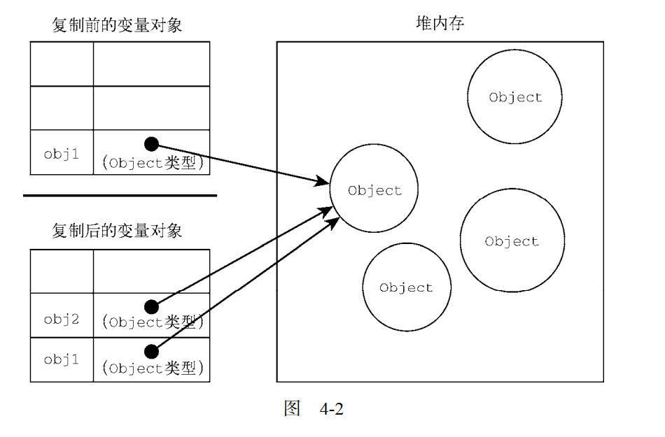

# 原始值和引用值

`ECMAScript变量`可以包含两种不同类型的数据:`原始值`和`引用值`。

**原始值(primitive-value)** 就是最简单的数据,比如 `String`,`Undefined`,`Null`,`Number`,`Symbol`,`Boolean`。
保存`原始值`的变量是 **按值(value)** 访问的。

**引用值(reference-value)** 则是由多个值构成的对象。由于`JavaScript`不允许直接访问内存位置,所以不能直接操作对象所在的内存空间。
在操作对象的时候,实际上操作的是对该对象的 **引用(reference)** 而非实际的对象本身。保存`引用值`的变量是 **按引用(reference)** 访问的。

## 动态属性

```Javascript
let person = new Object();
person.name = 'Nickolas';
console.log(person.name); //Nickolas
```

- 首先创建了一个对象,并把它保存在变量`person`中。
- 然后给对象添加了一个名为`name`的属性
- 给这个属性赋值了一个`'Nickolas'`字符串。
- 在此之后就可以访问这个新属性,直到对象被摧毁或者属性被显示的删除

```Javascript
let name = 'Nickolas'
name.age = 27
console.log(name.age) // undefined
```

- `原始值`不能由属性,尽管尝试给`原始值`添加属性不会报错

```Javascript
let name1 = 'Nickolas'
let name2 = new String('Matt')
name1.age = 27
name2.age = 26

console.log(name1.age) // undefined
console.log(name2.age) // 26

console.log(typeof name1) // string
console.log(typeof name2) // object
```

- `原始类型`的初始化可以使用`原始字面量形式`。
- 如果使用的是 `new`关键字,则`JavaScript`会创建一个`Object`类型的实例

## 复制值

`原始值`和`引用值`在通过变量复制的时候也有所不同。

### 原始值复制值

- `num1` 包含数值 `5`。当把`num2`初始化为`num1`的时候,`num2`也会得到数值`5`。
- `num2` 这个值跟存储在`num1`中的 `5`是完全独立,因为它是`num1`的这个值的`副本`。
- 这两个变量可以独立使用,互不干扰。

```javascript
let num1 = 5;
let num2 = num1;
```



### 引用值复制值

- `引用值`复制的值,实际上是一个`指针`。它指向存储在`堆内存`中的`对象`。
- 操作完成后, 两个`变量`实际上指向同一个`对象`, 因此一个对象上面的变化会在另一个对象上反映出来。

```javascript
let obj1 = new Object();
let obj2 = obj1;

obj1.name = "Nickolas";
console.log(obj2.name); // Nickolas
```



## 传递参数

`ECMAScript` 中所有的函数的参数都是按值传递的。

如果是`原始值`,那么就跟`原始值`的复制一样。如果是`引用值`,那么就跟`引用值`变量得复制一样。

### 原始值传递参数

```javascript
function addTen(num) {
  num += 10;
  return num;
}

let count = 20;
let result = addTen(count);

console.log(count); // 20
console.log(result); // 30
```

### 引用值传递参数

- 当`person`传入`setName()`时, `setName()`函数形参的`obj`指针指向的是`person`。
- 所以修改 `obj.name = "Nicholas" ` 的时候 `person`里面的数据,也会被一起修改。
- 然后变量`obj`被设置为一个新对象的时候,`obj`的指针不在指向`person`。它变成了一个指向本地对象的指针，而这个指针在函数执行结束之后就已经被销毁了

```javascript
function setName(obj) {
  obj.name = "Nicholas";
  obj = new Object();
  obj.name = "Greg";
}

let person = new Object();
setName(person);
console.log(person.name); //Nicholas
```
