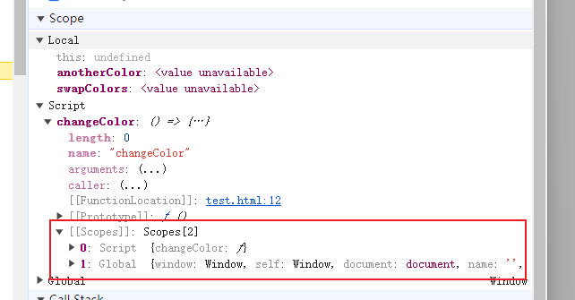
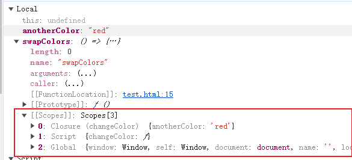

# 作用域

## 变量对象

`变量对象`是与`执行上下文`相关的数据作用域，存储了在上下文中定义的 **变量** 和 **函数声明**。

## 全局执行上下文

`全局执行上下文`中的变量对象就是全局对象

## 函数执行上下文

在`函数执行上下文`中，使用**活动对象(Activation Object,AO)** 来表示变量对象。

**活动对象**和**变量对象**其实是同一个东西,**活动对象**是在进入函数执行上下文时刻被创建的。

**活动对象**使用函数的 `arguments` 属性初始化。`arguments` 属性值是 [Arguments 对象](https://developer.mozilla.org/zh-CN/docs/Web/JavaScript/Reference/Functions/arguments)

## 执行步骤

```javascript
var color = "blue";

const changeColor = () => {
  let anotherColor = "red";

  const swapColors = () => {
    let tempColor = anotherColor;
    anotherColor = color;
    color = tempColor;
    // 这里可以访问 color、 anotherColor 和 tempColor
  };

  // 这里可以访问 color 和 anotherColor，但访问不到 tempColor
  swapColors();
};

// 这里只能访问 color
changeColor();
```

- 调用函数执行的时候,会创建**变量对象**的**作用域链**
- 这个作用域链决定各级上下文中的代码在**访问变量**和**函数**的顺序。
- 代码正在执行的上下文始终位于**作用域链**的最前端。
- 代码执行时的**变量**和**函数**等标识符的解析,是通过沿**作用域链**逐级**搜索标识符**名称完成的。
- 搜索过程始终从**作用域**的*最前端*开始,然后逐级往后,直到找到标识符。(如果没有标识符，通常会报错)




