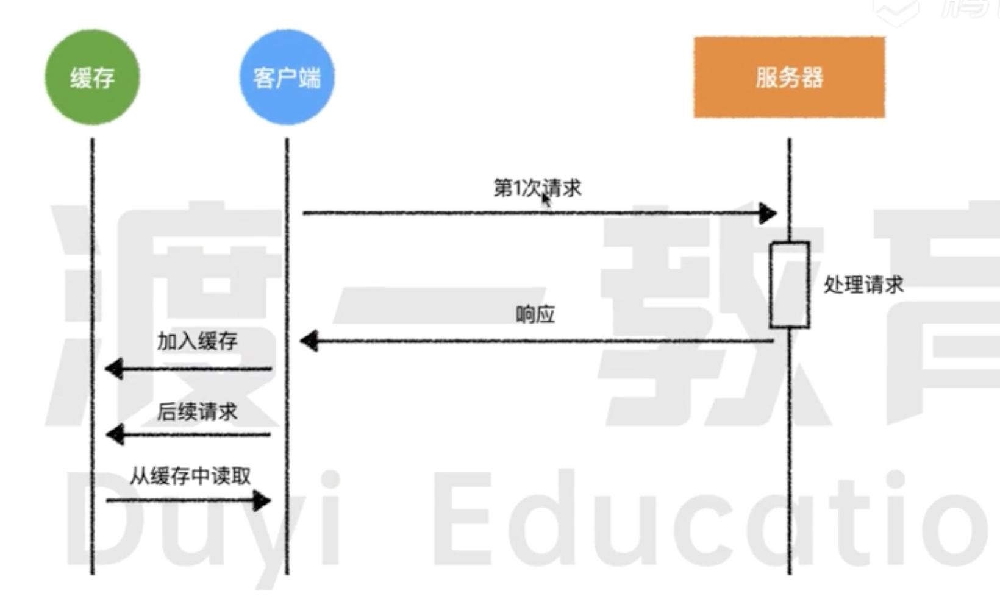
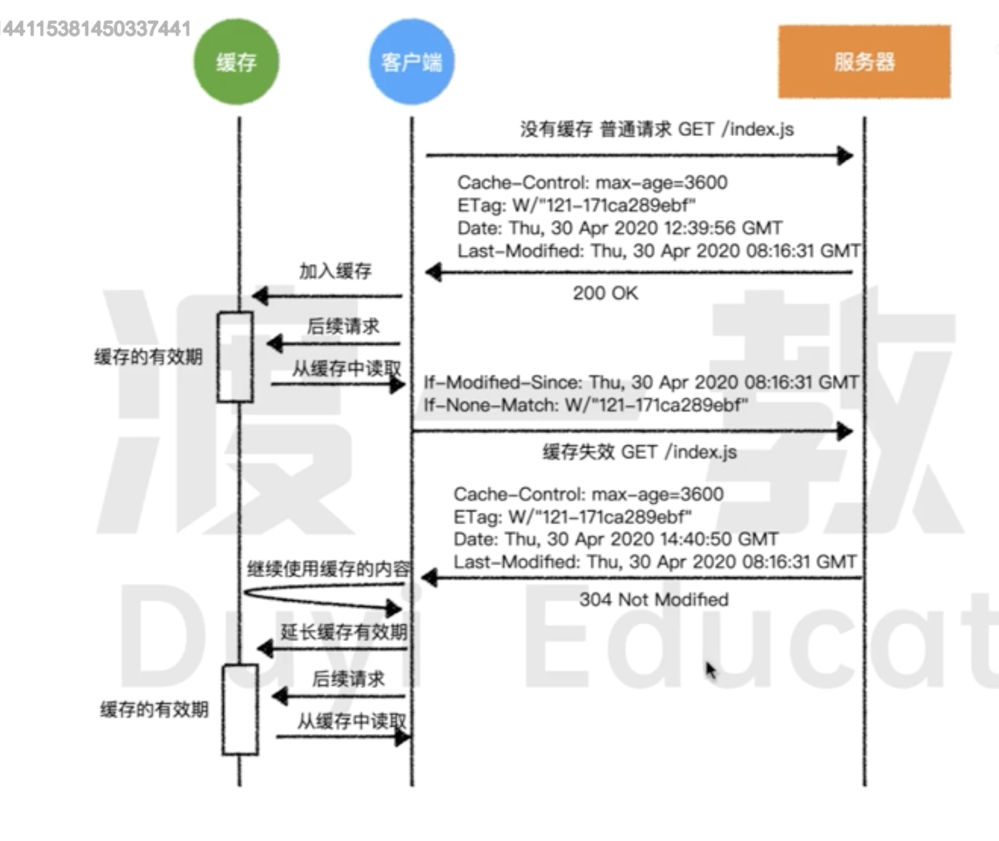

# 浏览器缓存协议

`浏览器缓存协议` 用于控制和管理浏览器缓存的行为。这些协议确保`资源`（如网页、图片、脚本）可以被缓存以提高加载速度和减少服务器请求。

## 浏览器缓存原理

浏览器缓存原理 如下图:



`浏览器缓存协议` 需要服务器 在响应头加入如下内容,才能达到`缓存`的效果:

```javascript
Cache-Control: max-age:3600
ETag: w/"121-171ca289ebf"
Date: Sat Aug 24 2024 21:04:23 GMT
Last-Modified: Sat Aug 24 2024 21:04:23 GMT
Expires:Sat Aug 24 2024 21:04:23 GMT
```

### Cache-Control

指定缓存策略 例如 `max-age`(缓存有效期),`no-cache`(需重新验证),`no-store`(不缓存)。

- **max-age**: 表示指定资源的缓存时长。比如 `3600`,就代表一个小时,单位`毫秒`。
- **no-cache**: 表示缓存的资源,每次使用的时候,需要向服务器确认资源是否过期,如果没有过期则可以继续使用。否则发起新的请求。
- **no-store**: 表示浏览器不需要对资源进行任何的缓存,每次都从服务端重新获取。

### ETag

资源的唯一标识符

### Expires

资源过期时间

### Date

表示服务器响应的时间戳,指示服务器生成响应的具体时间。

在浏览器的缓存策略中,通常会结合`Cache-Control`的`max-age`字段,帮助确定浏览器缓存的有效性和过期时间。

### Last-Modified

资源的最后修改时间,它帮助客户端和服务器判断资源是否发生变化，以便决定是否需要重新下载资源。

## 协商缓存

协商缓存基本流程如下:



### 查看是否有缓存的资源

- 根据请求方法和路径来匹配是否有缓存的资源。

### 缓存有效

- 如果缓存有效,则继续使用缓存,不发起请求

### 缓存失效

如果浏览器发现缓存已经过期,会向服务器发起**一个带缓存的请求**,也称之为**协商缓存**。

协商缓存,需要携带下列的请求头:

```javascript
if-Modified-Since:Sat Aug 24 2024 21:04:23 GMT
if-None-Match:Sat  w/"121-171ca289ebf"
```

- **if-None-Match**

服务器为资源生成的唯一标识符`ETag`,客户端在后续请求头中使用 `If-None-Match`询问服务器 缓存是否可用

- **if-Modified-Since**

服务器返回资源的最后修改时间`Last-Modified`,客户端在后续请求头中使用 `If-Modified-Since`询问服务器 缓存是否可用

服务器会据`if-None-Match`和`if-Modified-Since`判断资源是否被修改, 如未修改，返回 `304 Not Modified`。否则返回一个 200 正常响应。

## 强缓存

强缓存 一般需要服务端在响应头中指定 `Catch-Control`和`Expires,确定缓存的到期时间。

缓存到期之前不会向服务端请求。

```javascript
Cache-Control: max-age:3600
Expires:Sat Aug 24 2024 21:04:23 GMT
```
