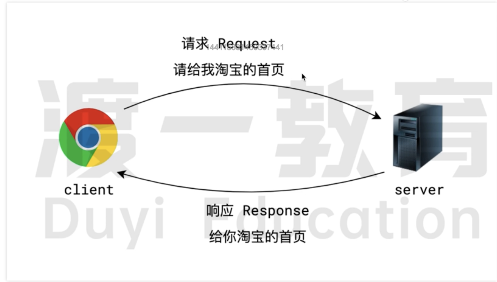

# 客户端和服务器

在网络的世界里,两个应用程序之间会经常发生通信

在大部分情况下,通信总是由一方发出一个消息开始到，而另一方回复一个消息结束

发出的消息的一方称之为 **`客户端 Client`**, 发出消息的过程称之为 **`请求 Request`**

回复的消息的一方称之为 **`服务器 Server`**, 回复消息的过程称之为 **`响应 Response`**

在这个过程中，有几个点需要**特别注意**

- 不管是客户端还是服务器 他们都是同一个应用程序，并不是一台计算机，`客户端`和`服务器`可以分布在不同的计算机上
  ，也可以在同一台计算机上,并不需要特殊看待。

  比如我们之前接触的 `live-server`插件，就是一个服务器 它就是运行在本地的计算机上。

  大部分后端开发的就是服务器程序，前端的 Node 技术也可能开发服务器程序

- 客户端和服务器的这种交互称之为**`[经典 C/S 架构]`**。在这种结构中，如果客户端是浏览器，则我们称之为 **`[ B / S 架构]`**

- 服务器往往是为互联网产品提供服务，因此又称为 `web 服务器`
