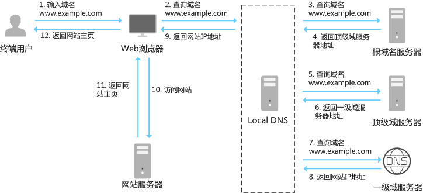

# DNS 解析

**DNS(域名系统)** 解析是将域名转换为 IP 地址的过程。基本步骤如下:

# 用户请求

用户在浏览器中输入网址,比如`www.example.com`。

## 本地 DNS 服务器

`本地 DNS 服务器` 一般指的是存储在用户设备上的 `DNS 缓存`,包括:

- **浏览器缓存**: 存储在浏览器中的 DNS 解析结果,帮助加快网站加载速度。
- **操作系统缓存**: 一般是指存储在`本地 host` 文件的缓存。
- **网络设备缓存**: 一般是指`路由器`或网络中的其他设备可能会有的 DNS 缓存,减少对外部 DNS 查询的需求。

## ISP DNS 服务器

当在用户客户端查找不到域名对应的 `IP 地址`,会进入`ISP DNS`缓存中进行查询。

如果使用的是电信的网络,则会进入电信的 `DNS 服务器`中进行查找。

## 根域名服务器

如果以上均未完成,则进入`根域名服务器`进行查询。

每个`根域名服务器`都知道所有的`顶级域名服务器`的`域名`及其`IP 地址`。

根域名收到请求后,把顶级域名的服务器 IP 地址告诉给`本地DNS服务器`

## 顶级域名服务器

`顶级域名服务器`收到请求后 把查询对应的 IP 地址,告诉给`本地DNS服务器`

## 权威服务器

`权威服务器`收到请求后查询自己的缓存,如果没有则进入下一级域名服务器进行查询。并且重复该步骤直至找到正确记录。
