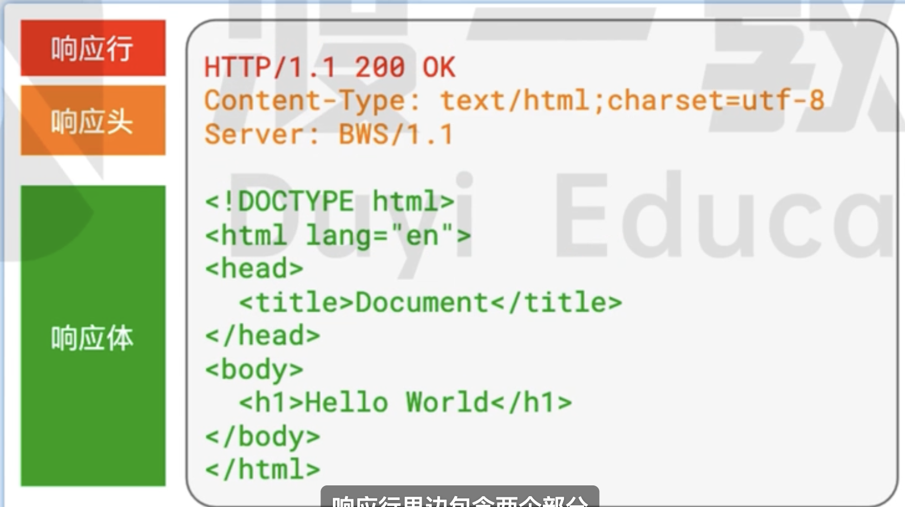

# HTTP 协议

**HTTP（HyperText Transfer Protocol，超文本传输协议**是一种用于传输超文本的应用层协议。它是 Web 上数据通信的基础。
HTTP 是一个无状态的协议，每个请求都是相互独立的，服务器不会保存关于客户端的任何信息。

## 什么是无状态协议

`无状态协议(Stateless Protocol)` 通信过程中不会保存客户端的状态信息,服务器不会在不同请求之间保留任何关于客户端的信息。

## 请求信息格式

客户端会向服务器发送请求消息,请求传递的消息分都是 **纯文本(字符串)**

:::note
请求的消息格式
:::

请求的消息由三部分组成，即**请求行,请求头,请求体**。

### 请求行

高度概括了客户端想要干什么

### 请求头

描述了一些请求的额外信息

### 请求体

传递给服务器的正文数据

## 请求方法

请求方法也叫 **HTTP 动词**。

| 方法    | HTTP 版本 1.0 | HTTP 版本 1.1 | 含义                                                                                                   |
| ------- | ------------- | ------------- | ------------------------------------------------------------------------------------------------------ |
| GET     | ○             | ○             | 请求指定资源的表示。使用 GET 的请求应该只用于请求数据，而不应该包含数据                                |
| POST    | ○             | ○             | 发送数据给服务器。**请求体的类型由 Content-Type 标头指定**                                             |
| HEAD    | ○             | ○             | 类似于 GET 请求，不过它只返回 HTTP 的消息头， 而并不返回数据的内容。用于获取文件最后更新时间等属性信息 |
| OPTIONS |               | ○             | 请求给定的 URL 或服务器的允许通信选项。                                                                |
| PUT     | △             | ○             | 创建一个新的资源或者使用请求体的内容**直接覆盖资源**,**PUT 方法是幂等的**。                            |
| DELETE  | △             | ○             | 请求服务器删除指定的资源。                                                                             |
| TRACE   |               | ○             | 回显服务器收到的请求，主要用于测试或诊断                                                               |
| CONNECT |               | ○             | 使用代理传输加密消息时使用的方法,把请求连接转换为透明的 TCP/IP 连接，通常用于代理服务器                |
| PATCH   |               | ○             | 用来对已知资源进行**局部更新**                                                                         |

## 常用的请求头

- `HOST`: url 地址的主机
- `User-Agent`: 客户端软件的名称和版本号等相关信息
- `Content-Type`: 用于指示资源的 **MIME 类型**

  - `application/octet-stream`:
    这是二进制文件的默认值。由于这意味着未知的二进制文件，浏览器一般不会自动执行或询问执行。
    浏览器将这些文件视为 **Content-Disposition** 标头被设置为 attachment 一样，并弹出“另存为”对话框。

  - `text/plain`: 这是文本文件的默认值。即使它其实意味着未知的文本文件，但浏览器认为是可以直接展示的

  - `multipart/form-data`: 可用于 HTML 表单从浏览器发送信息给服务器

  - `application/json`: 用于指示消息主体（body）中所包含的数据是 JSON 格式的。它告诉接收端如何解析和处理传输的数据。

  - `application/x-www-form-urlencoded`:是一种在 HTTP 请求中常用的编码格式，用于传输表单数据到服务器。表单数据以键值对的形式提交，每个字段名和字段值之间用 "=" 连接，
    不同字段之间用 "&" 连接，同时进行 URL 编码处理。例如，键值对 "name=John&age=30" 在 "application/x-www-form-urlencoded"
    编码后会变成 "name=John&age=30"，然后作为请求的消息主体（body）发送给服务器。

## 响应信息格式

### 响应行

响应行是整个响应字符串的第一行

响应行包含两个部分

- **协议版本**: 表示服务器打算用什么协议和客户端进行通信。
- **状态码，状态消息**: 表示服务器对当前请求的表态。

**通常**,**状态码** 和状态消息是一一对应的,比如 200 的消息就是 **OK**

状态码一般分为五类

| 分类 | 分类描述                                           |
| ---- | -------------------------------------------------- |
| 1xx  | **信息**,服务器收到请求,需要请求者继续执行操作。   |
| 2xx  | **成功**,操作被成功接收并处理。                    |
| 3xx  | **重定向**, 需要进一步的操作完成请求               |
| 4xx  | **客户端错误**, 请求包含语法错误，或者无法发起请求 |
| 5xx  | **服务器错误**,服务器在处理请求的过程中发生了错误  |

通常认为,**0~399** 的状态码都是正常的,其他都是不正常的。

### 常见的状态码

- **200**:一切正常

- **301 Move Permanently**:请求的资源已被永久移动到新位置
  - 请求已经收到,资源已经永远的把它移动到了一个新地址, 新地址 放在了响应头的`Location`中
- **302 Found**:请求的资源临时移动到新位置
  - 请求已经收到,资源已经临时把它移动到了一个新地址, 新地址 放在了响应头的`Location`中
- **304 Not Modified**:文档内容没有被修改

- **400 Bad Request**: 请求的语法有错误,当前请求无法被服务器理解
- **401 Unauthorized**:请求要求用户的身份认证。
- **403 ForBidden**:服务器拒绝执行
- **404 Not Found**:当前请求的资源不存在

- **500 Internal Server Error**:服务器内部错误。
- **502 Bad Gateway**: 服务器作为网关或者代理，从上游服务器收到无效响应。

### 响应头

和`请求头`的格式一样,响应头也是由很多个键值对组成的。表示的是响应体的数据类型是什么。

在`B/S模式`中,浏览器会根据响应头中的`Content-type`的取值,决定如何处理响应体:

- `text/plain`

  普通的纯文本,浏览器通常会将响应体原封不动的展示到页面上。

- `text/html`:

  html 文档,浏览器通常会将响应体原封不动的显示到页面上。

- `text/javascript`:

  js 代码,浏览器通常会使用 JS 引擎将它解析执行

- `text/css`:

  css 代码,浏览器通常会将它视为样式

- `image/jpeg`:

  浏览器通常会将它视为图片

- `attachment`:

  附件,浏览器看到这个类型,通常会触发下载功能。

- 其他`MIME类型`

### 响应体

服务器响应的主体内容
