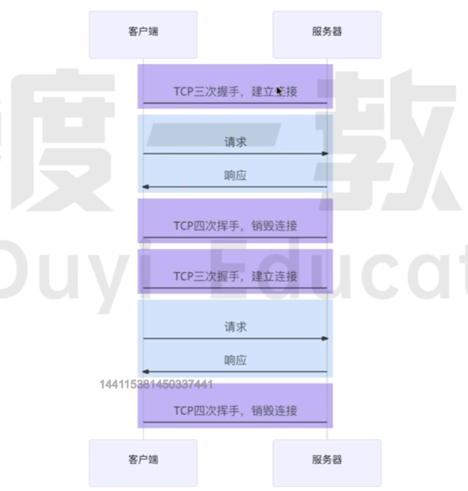
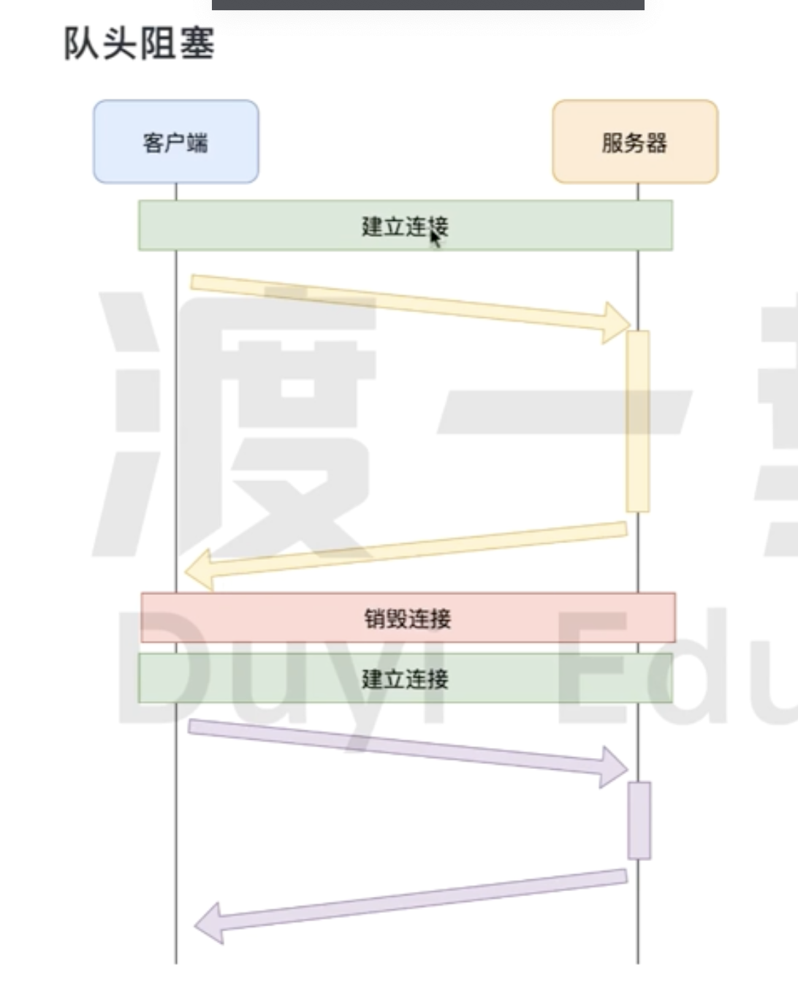
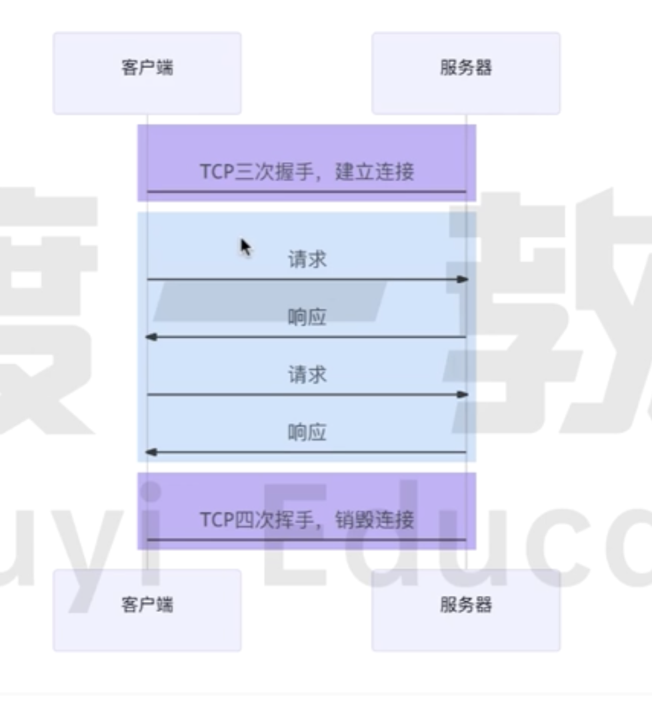
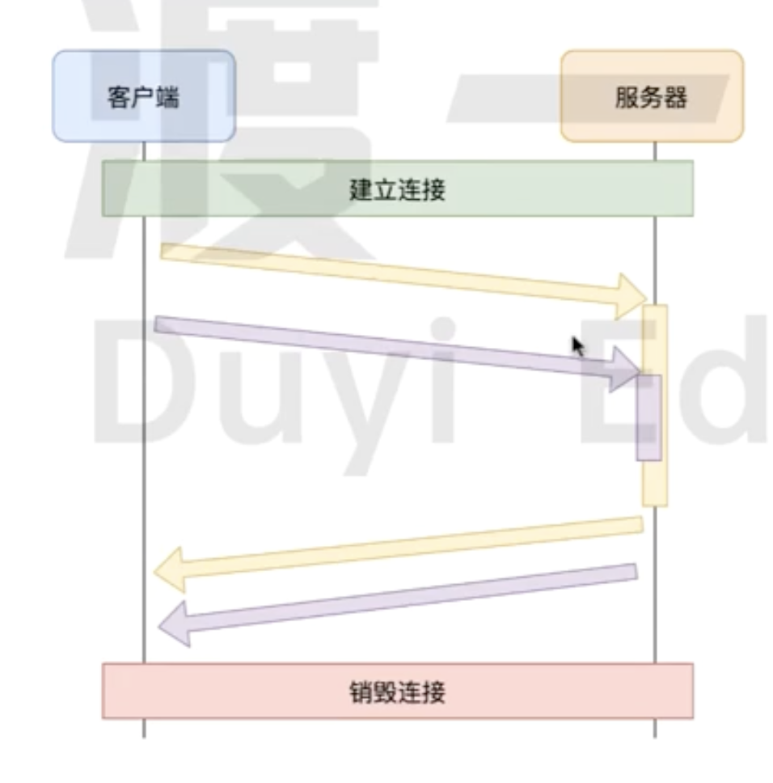
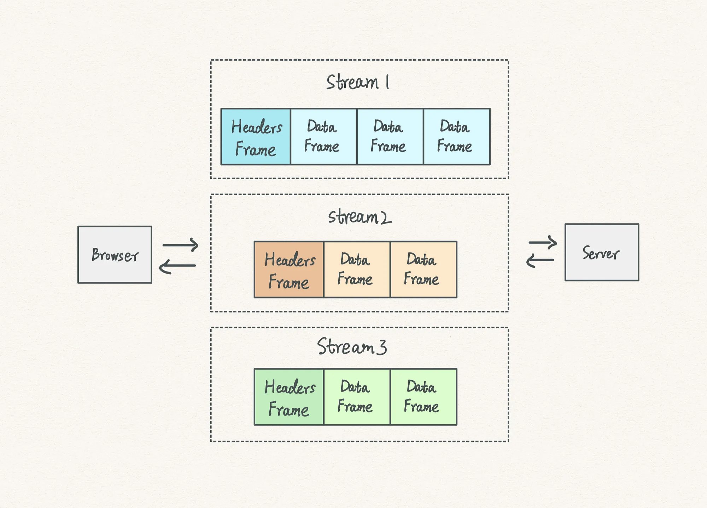
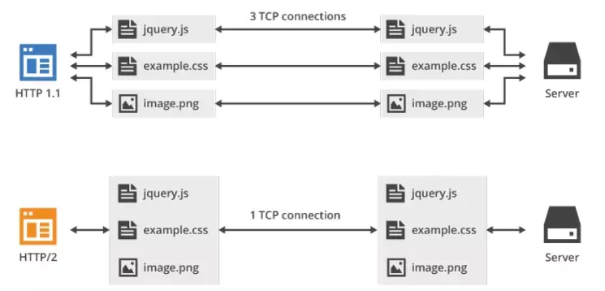
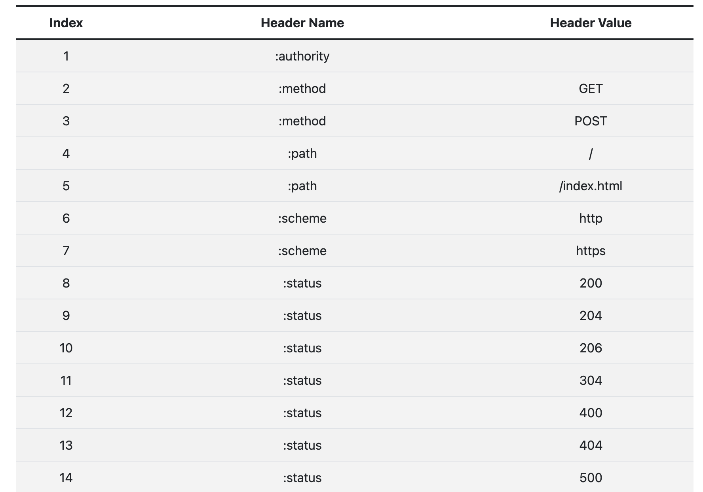

# HTTP 版本

## HTTP 1.0

### 请求方法

- 只有 `GET`、 `POST`、 `HEAD`请求方法

### 无法复用连接

- 每次`请求`或者`响应`都需要建立关闭一个独立的`TCP链接`。增加了网络延迟和开销。
- 不支持长连接的机制,导致频繁的`TCP链接`建立和关闭,影响性能。
- 不能充分利用宽带资源,造成带宽资源的浪费

:::info
因为**TCP 协议** 慢启动的特点,即一开始传输的时候数据量少,一段时间之后达到传输的峰值。
所以按照 **HTTP1.0** 这种传输方式,会导致大量的请求在 **TCP** 达到传输峰值就已经结束了。
:::

### 队头堵塞

- 一个 **TCP 链接** 不能同时处理多个请求,造成请求处理的顺序依赖于响应的完成。也就是**队头堵塞**的原因

### 缓存机制

- **HTTP1.0**缓存机制相对简单,主要通过 `Expires`实现。 缺少完善的`缓存机制`和`缓存策略`。

## HTTP 1.1

### 长连接

- **HTTP 1.1** 默认开启**长连接**,
- 支持长连接,可以在一个**TCP 链接**上处理多个请求/响应
- 减少 **TCP 链接** 频繁的创建关闭。同时减少了`TCP三次握手`和`四次挥手`的时间
- 因为**TCP 协议** 慢启动的特点, **长连接**可以充分有效的利用带宽。

:::info
**Connection:keep-alive** 是为了解决**HTTP 1.0**不支持长连接使用的请求头。
:::

### 缓存机制

- **HTTP1.1**完善了之前的缓存机制。[增加了协商缓存策略](./cache-protocol.mdx) 。

### 请求方法

- 新增了`OPTIONS`,`PUT`,`DELETE`,`TRACE`,`CONNECT`,`PATCH`等方法。

### 管道化

**HTTP 1.1**允许在响应到达之前发送下一个请求,这样可以大幅度缩减带宽限制时间。

- 多个 **HTTP 请求**不用依赖上一个响应的完成，可以批量发送，这就解决了 HTTP 队头阻塞问题
- 但是批量发送的请求,服务器必须要按照请求到达的顺序返回。仍然没有彻底解决**队头堵塞**的问题

:::info
由于多个请求使用的是同一个**TCP 链接**,服务器必须要按照请求到达的顺序返回。

因为 **HTTP** 是一个无状态协议, 每个请求和响应并没有序号标识，无法将乱序的响应与请求关联起来。

除了这些管道化可能会带来一些意料之外的结果,所以现代浏览器基本都没有支持这个特性。
:::

因为**HTTP1.1**还是存在**队头堵塞**的问题,我们需要对一些大量**HTTP 请求**的网站使用[网络性能优化](./performance.mdx)

## HTTP 2

**HTTP/2** 是现行 **HTTP 协议**(HTTP/1.x)的替代,但它不是重写,**HTTP 方法 / 状态码 / 语义**都与 **HTTP/1.1** 一样。

从目前的情况来看，国内外一些排名靠前的站点基本都实现了 **HTTP 2.0** 的部署，使用 **HTTP 2.0**能带来 **20%~60%** 的效率提升。

可以通过这个图片直观感受下 **HTTP/2** 比 **HTTP/1.1** 到底快了多少

### 基本概念

- **帧(Frame)**:通信的基本单位。一个 **TCP 连接**上可以有任意数量的流。
- **流(Stream)**: 已建立的 **TCP 连接**上的双向字节流，可以承载一个或多个消息。
- **消息(Message)**: 一个完整的 **HTTP 请求**或**响应**，由一个或多个**帧(Frame)**组成。特定消息的**帧(Frame)**在同一个**流**上发送，这意味着一个 HTTP 请求或响应只能在一个**流(Stream)**上发送。

### 二进制帧

**HTTP/2** 是如何做到「突破 **HTTP/1.1** 的性能限制，改进传输性能，实现低延迟和高吞吐量」的 ?

关键之一就是在 **应用层(HTTP/2)** 和 **传输层(TCP or UDP)** 之间增加一个二进制分帧层

- **HTTP/2** 会将所有的传输信息分割为更小的消息和**帧(frame)**,并对他们采用**二进制格式**的编码。
- **HTTP/1.x**的头部信息会被封装到**HEADERS** 帧,对应的**Request Body**则封装到 **DATA 帧**里面。
- **HTTP/2** 数据分帧后,“Header+Body"的报文结构就完全消失了,协议看到的只是一个个"碎片”。

- 每个数据流都以**消息(Message)** 的形式发送,而**消息(Message)** 又由一个或多个 **帧(Frame)** 组成。
- 多个**帧(Frame)** 之间可以乱序发送，根据**帧(Frame)** 首部的**流(Stream)** 标识符可以重新组装完整的**消息(Message)**。

### 多路复用

在**HTTP/2**中,**同域名**下所有通信都在单个 **TCP 连接** 上完成, 解决了浏览器限制同一个**域名**下请求数量的问题。

规避了**TCP 连接**慢启动的特点,也更容易充分利用带宽资源,实现全速传输。这一特性使得 HTTP 传输性能得到极大提升。

#### 多工

**HTTP/2**中 复用 TCP 连接，在一个连接里，客户端和浏览器都可以同时发送多个请求或回应，而且不用按照顺序一一对应，这样就避免了**队头堵塞**的问题。

#### 优先级

在 **HTTP/2** 中，每个请求都可以带一个 `31bit` 的优先值，`0`表示最高优先级,数值越大优先级越低。有了这个优先值，客户端和服务器就可以在处理不同的流时采取不同的策略，以最优的方式发送**流(Stream)**、**消息(Message)**和**帧(Frame)**。

### Header 压缩(HPACK)

在**HTTP/2**之前,所有的消息头都是以字符串的形式完整传递的。实际上大部分的请求头字段有很多都是重复的,比如 **Cookie** 和 **User Agent**。

- **HTTP/2**为此采用 **HPACK** 压缩头部,来减少消息头的体积。
- **客户端**和**服务器**共同维护一个消息头的**静态表**,包含常见的头部名称，以及常见的头部名称和值的组合。
- **客户端**和**服务器**维护一份相同的动态字典,可以动态的添加内容。

所以我们在传输**消息头**的时候,先尝试从**静态表**或者**动态表**进行查询匹配,对应的索引值。

如果**静态表**或者**动态表** 都没有匹配到,通过 **Huffman** 压缩后进行传输,同时浏览器或者服务端会把它添加到自己的**动态表**中。

**HTTP/2** 的静态字典（只截取了部分，[完整表格](https://httpwg.org/specs/rfc7541.html#static.table.definition)在这里）：

### 服务器推送

**HTTP/2**允许在客户端没有主动请求的情况下,向客户端发送资源,服务端预先会把资源推送给服务端。

当客户端后续需要请求资源的时候,自动从之前推送的资源中去寻找。

这样就可以相对减少一点延迟时间。当然在浏览器兼容的情况下也可以使用 **prefetch** 。

:::warning
服务端可以主动推送，客户端也可以主动选择是否接收。

如果服务端推送的资源已经被浏览器缓存过，浏览器可以通过发送 `RST_STREAM` 帧来拒收，另外，主动推送也遵守同源策略
:::
