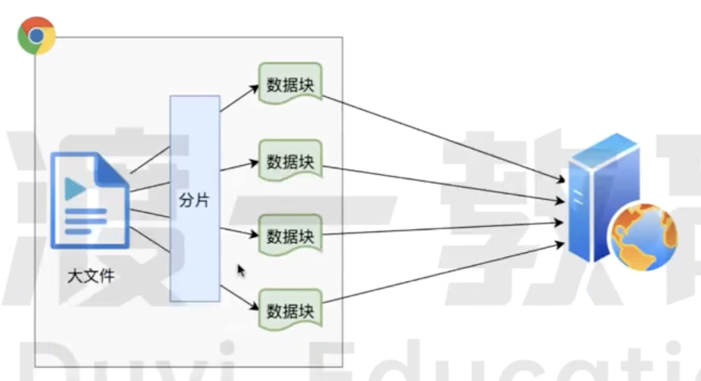

# 大文件上传



## 读取文件

```html
<input type="file" />
<button id="upload">点击上传</button>
<div style="width: 300px" id="progress"></div>
```

### JS 实现文件读取

```javascript
const input = document.querySelector("#file");
const upload = document.querySelector("#upload");
const progress = document.querySelector("#progress");
let file;

input.addEventListener("change", (e) => {
  file = e.target.files[0];
});

upload.addEventListener("click", (e) => {
  if (_.isNil(file)) {
    alert("请选择文件");
  }
});
```

## 创建文件切片

```javascript
const createChunkList = (file) => {
  // 按照2MB的大小切片文件
  const chunkSize = 2 * 1024 * 1024;
  const chunkList = [];
  const chunks = Math.ceil(file.size / chunkSize);

  for (let index = 0; index < chunks; index++) {
    const start = index * chunkSize;
    const end = start + chunkSize >= file.size ? file.size : start + chunkSize;
    chunkList.push(file.slice(start, end));
  }

  return chunkList;
};
```

## 上传文件

```javascript
const allSettledWithRetries = async (promises, retries = 5) => {
  const result = await Promise.allSettled(promises);

  const successResponses = [];
  result.forEach((item) => {
    if (item.status === "fulfilled") {
      successResponses.push(item.value);
    }
  });

  if (retries > 0 && successResponses.length !== promises.length) {
    const failedPromises = [];
    result.forEach((item, index) => {
      if (item.status === "rejected") {
        failedPromises.push(promises[index]);
      }
    });

    await new Promise((resolve) => setTimeout(resolve, 3000));

    const failedResults = await allSettledWithRetries(
      failedPromises,
      retries - 1
    );

    failedResults.forEach((promiseResult) => {
      if (promiseResult.status === "fulfilled") {
        successResponses.push(promiseResult.value);
      }
    });
  }

  return successResponses;
};

upload.addEventListener("click", async (e) => {
  if (_.isNil(file)) {
    alert("请选择文件");
  }

  const chunkList = createChunkList(file);

  const fileList = await allSettledWithRetries(
    chunkList.map((item) => {
      const formData = new FormData();
      formData.append("file", item.file); //该文件
      formData.append("fileName", item.fileName); //文件名
      formData.append("chunkName", item.chunkName); //切片名
      return fetch("http://127.0.0.1:8000/upload", {
        method: "POST",
        body: formData,
      });
    }),
    5
  );

  if (fileList.length === chunkList.length) {
    await fetch("http://127.0.0.1:8000/merge", {
      method: "POST",
      body: JSON.stringify({
        fileName: file.name,
        size: file.size,
      }),
    });
  }
});
```

## 部署上传服务

```javascript
const http = require("http");
const multiparty = require("multiparty"); // 中间件，处理FormData对象的中间件
const path = require("path");
const fse = require("fs-extra"); //文件处理模块
const server = http.createServer();
const UPLOAD_DIR = path.resolve(__dirname, ".", "qiepian"); // 读取根目录，创建一个文件夹qiepian存放切片

server.on("request", async (req, res) => {
  // 处理跨域问题，允许所有的请求头和请求源
  res.setHeader("Access-Control-Allow-Origin", "*");
  res.setHeader("Access-Control-Allow-Headers", "*");

  if (req.url === "/upload") {
    //前端访问的地址正确
    const multipart = new multiparty.Form(); // 解析FormData对象
    multipart.parse(req, async (err, fields, files) => {
      if (err) {
        //解析失败
        return;
      }
      console.log("fields=", fields);
      console.log("files=", files);

      const [file] = files.file;
      const [fileName] = fields.fileName;
      const [chunkName] = fields.chunkName;

      const chunkDir = path.resolve(UPLOAD_DIR, `${fileName}-chunks`); //在qiepian文件夹创建一个新的文件夹，存放接收到的所有切片
      if (!fse.existsSync(chunkDir)) {
        //文件夹不存在，新建该文件夹
        await fse.mkdirs(chunkDir);
      }
      // 把切片移动进chunkDir
      await fse.move(file.path, `${chunkDir}/${chunkName}`);
      res.end(
        JSON.stringify({
          //向前端输出
          code: 0,
          message: "切片上传成功",
        })
      );
    });
  }
});

server.listen(8000, () => {
  console.log("8000端口 服务已启动");
});
```

## 服务端文件合并

```javascript
if (req.url === "/merge") {
  // 该去合并切片了
  const data = await resolvePost(req);
  const { fileName, size } = data;
  const filePath = path.resolve(UPLOAD_DIR, fileName); //获取切片路径
  await mergeFileChunk(filePath, fileName, size);
  res.end(
    JSON.stringify({
      code: 0,
      message: "文件合并成功",
    })
  );
}
// 合并
async function mergeFileChunk(filePath, fileName, size) {
  const chunkDir = path.resolve(UPLOAD_DIR, `${fileName}-chunks`);
  let chunkPaths = await fse.readdir(chunkDir);
  chunkPaths.sort((a, b) => a.split("-")[1] - b.split("-")[1]);
  const arr = chunkPaths.map((chunkPath, index) => {
    return pipeStream(
      path.resolve(chunkDir, chunkPath),
      // 在指定的位置创建可写流
      fse.createWriteStream(filePath, {
        start: index * size,
        end: (index + 1) * size,
      })
    );
  });
  await Promise.all(arr); //保证所有的切片都被读取
}
// 将切片转换成流进行合并
function pipeStream(path, writeStream) {
  return new Promise((resolve) => {
    // 创建可读流，读取所有切片
    const readStream = fse.createReadStream(path);
    readStream.on("end", () => {
      fse.unlinkSync(path); // 读取完毕后，删除已经读取过的切片路径
      resolve();
    });
    readStream.pipe(writeStream); //将可读流流入可写流
  });
}
// 解析POST请求传递的参数
function resolvePost(req) {
  // 解析参数
  return new Promise((resolve) => {
    let chunk = "";
    req.on("data", (data) => {
      //req接收到了前端的数据
      chunk += data; //将接收到的所有参数进行拼接
    });
    req.on("end", () => {
      resolve(JSON.parse(chunk)); //将字符串转为JSON对象
    });
  });
}
```
