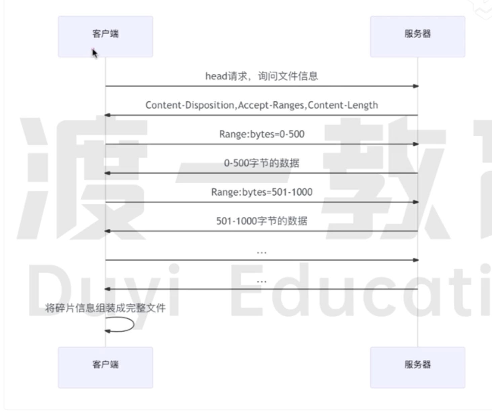

# 断点下载

## Accept-Range

如果要实现下载时的断点续传功能,需要服务端在响应的时候,在响应头中加入`Accept-Range`这个字段。

`Accept-Range`字段告诉`客户端`服务器是否支持部分内容请求，即断点续传。

```javascript
Accept-Range:bytes
```

### 字段值

- **bytes**: 表示服务器支持按字节范围请求。
- **none**:表示服务器不支持范围请求。

## 基本原理



- 如果客户端支持断点续传,会发送`HEAD`请求访问文件具体信息
- 客户端发出包含带有 `Range`的请求。

### Range

`Range`字段用于请求资源的部分内容,它告诉服务器客户端希望获取资源的哪一部分。

```javascript
Range: bytes = start - end;
```

**例如**: 表示客户端想要获取 `0` 到 `500` 字节的数据

```javascript
Range: bytes = 0 - 500;
```
