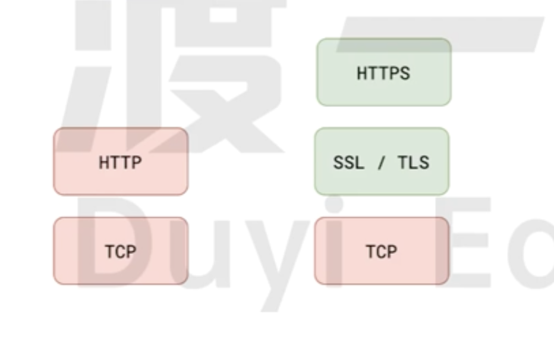
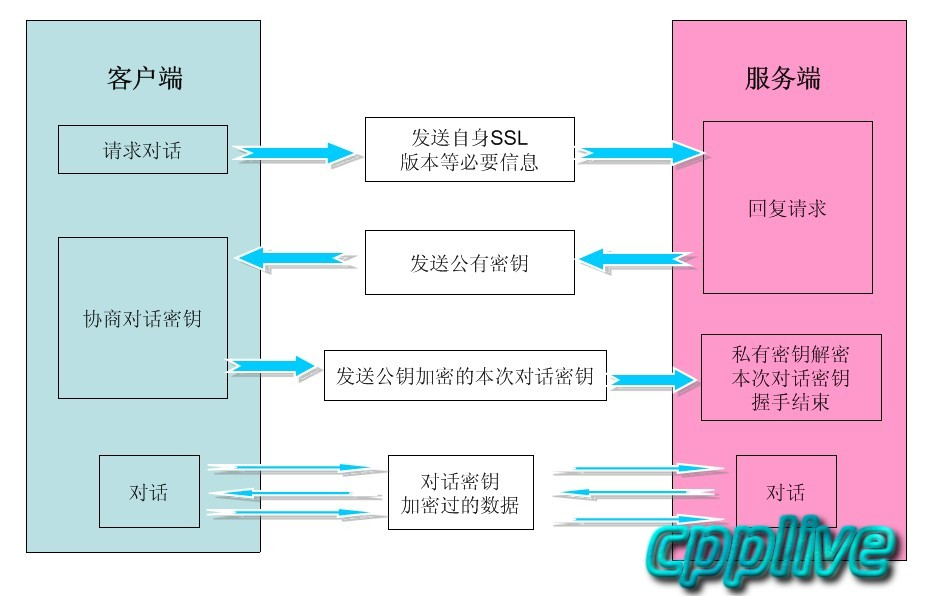

# SSL 协议

## 什么是 SSL 协议

**SSL 协议 (Secure Sockets Layer) 安全套接字层** ，用于在服务器和客户端之间创建加密的网络链路，确保传递的所有数据都是私密且安全的。

**SSL 协议** 是最早用于网络加密的技术。 现在，现代浏览器和服务器已不再支持该功能。**TLS 协议 (Transport Layer Security) 传输层安全协议** 是目前推荐使用的标准。

**SSL/TLS 协议**的主要功能实现主要依赖于三大算法:

- [非对称加密算法](./encrypt.mdx):实现**身份认证**和**密钥协商**
- [对称加密算法](./encrypt.mdx): 采用协商的密钥对**数据加密**
- **哈希算法**:验证信息的**完整性**

**HTTPS 协议** 是建立在**SSL/TLS 协议** 之上的。

## 基本原理

- `客户端`请求`服务端`,获取`服务端`的`公钥key`
- `客户端`随机生成一个`对话密钥` 使用 `公钥key`加密,只有`服务端`的`私钥`可以解密,这样`客户端`和`服务端`都会有一份`对话密钥`。
- `客户端`和`服务器`采用`对话密钥`进行加密通信,这样可以保证`数据传输`的效率,双方都可以对加密的数据进行解密。

## CA 证书

为了确保`公钥key`不被`“中间人“`篡改以及攻击。需要把`公钥key`放在数字证书里面,只要数字证书是可信的,公钥就可以信任。

### 基本组成

- **绑定的域名**
- **颁发证书的机构**
- **使用 CA 私钥加密的公钥**
- **使用 CA 私钥加密的签名**
  - 证书绑定的域名
  - 服务端的`公钥key`
  - CA 证书的`公钥key`

## 验证证书是否合法

- 检查证书列出的**域名**是否和用户实际访问的**域名**匹配
- 检查证书是否在**有效期** 内
- 通过`CRL`和`OCSP`检验证书是否被**吊销**
- 检查**颁发证书的机构** 是不是受客户端信任
- 使用`CA 证书`的公钥**验证签名**,是否和当前证书的签名一致
