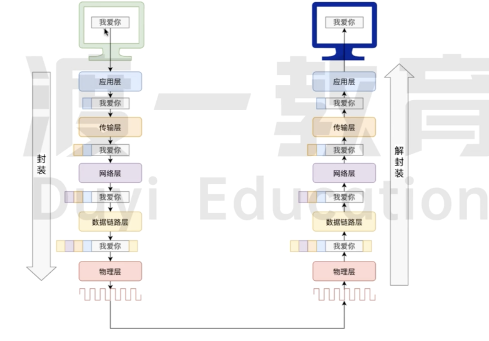

# 五层网络模型

`五层网络模型`通常指的是 `TCP/IP 五层模型`。有如下特点分别是:

- 每层相互独立,只需要解决自己的问题
- 每层无需考虑自己的问题,仅需要把自己的结果交给下层即可
- 每层有多种方案可以选择,选择的不同的方案不会对上下层造成影响
- 每一层会在上一层的基础上增加一些额外信息

它是一个广泛使用的网络架构，包含了五个层次，分别是：

## 应用层 (Application Layer):

- 提供用户接口和服务，支持网络应用程序的开发和访问。
- 包括 `HTTP`、`FTP`、`SMTP` 等协议。

## 传输层 (Transport Layer):

- 为应用层实体提供端到端的通信功能,保证了数据包的顺序传送及数据的完整性。
- 该层定义了两个主要的协议:`传输控制协议(TCP)`和`用户数据报协议(UDP)`.

## 网络层 (Network Layer):

- 负责对子网间的数据包进行路由选择，实现不同网络之间的数据包传输。
- 主要协议包括 `IP(Internet Protocol)`和`路由器`。

## 链路层 (Data Link Layer):

- 管理物理网络中节点之间的数据帧传输，提供物理地址(MAC 地址)的识别
- 包括`以太网协议`和 `交换机` 等技术。

## 物理层 (Physical Layer):

- 负责传输原始比特流，定义物理连接的特性，如电压、速率等。
- 包括传输介质，如光纤、电缆等。

## 数据的封装和解封装

