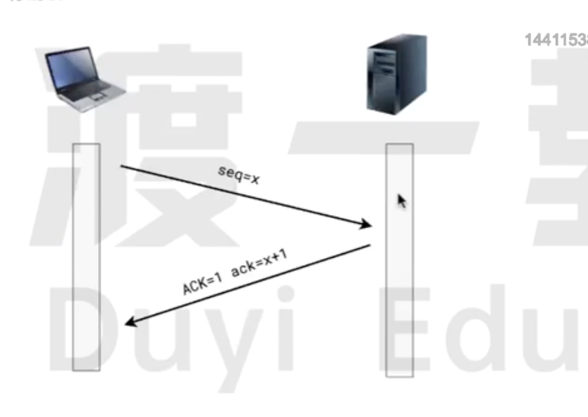
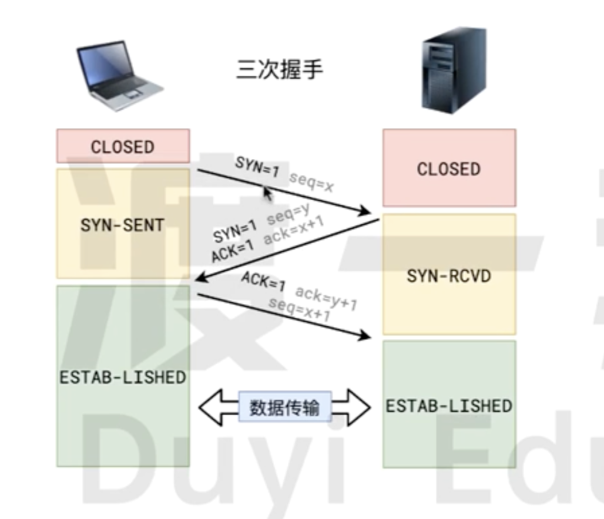

# TCP 协议

`TCP协议` 是一种面向连接的、可靠的传输层协议。它确保数据在网络中按顺序且无差错地传输。

## TCP 收发数据流程

### 建立连接

通过`三次握手`过程建立连接

### 数据发送

发送方将数据`分段`，并在每个数据段上附加`序列号`。数据通过网络发送到接收方。

### 确认接收

接收方接收数据段并发送 `ACK(确认)`报文段，确认收到的数据。确认报文段中包含`下一个`期望接收的`序列号`

### 重传机制

如果发送方未收到确认`报文段`，会在超时后重传`数据段`。

### 流量控制

发送方和接收方通过`滑动窗口机制`调节数据流量，确保接收方不会过载。

### 连接终止

通过`四次挥手`过程终止连接，确保双方都完成数据传输并关闭连接.

## TCP 如何确保可靠传输

在`TCP协议中`, 任何时候 , 任何一方都可以主动发数据给另一方。

为了解决数据错乱,数据丢失等问题,`TCP协议`要求:**接收方接收到数据报文之后,必须要做出确认!**

- **seq**: 表示这次数据报文的序号
- **ACK**: 表示这次数据报文是一个确认数据包
- **ack**: 表示期望下一次接收的的数据报文序号

如果发送方长时间没有收到`ACK(确认)`,则会判定丢失或者是错误。然后重新发送

## 连接的建立(三次握手)

`TCP 协议`要实现数据的收发,必须要先建立连接,连接的本质其实就是在双方开辟一块内存空间。

`三次握手`是建立 `TCP 连接`的过程。确保双方都能`发送`和`接收数据`。过程如下:

- 客户端向服务器发送一个 **SYN(同步)** 报文段，请求建立连接。

- 服务器收到 **SYN(同步)** 报文段后，回复一个 **SYN-ACK** 报文段，确认接收到连接请求，并发送一个 **SYN(同步)** 报文段 给客户端。

- 客户端收到 **SYN-ACK** 报文段 后，发送一个 **ACK(确认)** 报文段给服务器，确认收到服务器的响应。

## 连接的销毁(四次挥手)

四次挥手是 `TCP` 连接终止的过程，确保双方都能完成数据传输并正常关闭连接。步骤如下:

- 客户端发送一个 **FIN(结束)** 报文段，表示不再发送数据。

- 服务器接收 **FIN(结束)** 报文段后, 发送一个 **ACK(确认)** 报文段,此时服务器连接的一半已经关闭，但是仍然可以继续发送数据，直到它也准备好关闭连接。

- 服务器在完成所有剩余的数据传输后,在发送一个 **FIN(结束)** 报文段,表示服务器没有更多的数据需要发送。

- 客户端收到之后服务端发送的 **FIN(结束)** 报文段之后,不会立即发送 **ACK(确认)** 报文段。
  因为需要确保服务器能收到 **ACK(确认)** 报文段,会等待**2MSL(2 倍的最大段寿命)**。在这之后再发送**ACK(确认)** 报文段。结束`TCP连接`

## HTTP 协议和 TCP 协议的关系

`HTTP 协议`是对内容格式的规定,它使用了`TCP协议`来完成可靠传输。

在具体使用`TCP协议`的时候

- 客户端发消息给服务器叫做`请求` 服务器发消息给客户端叫`响应`。
- 使用`HTTP 协议`的服务器不会主动发消息给客户端(尽管 TCP 可以)。它只对请求进行响应。
- 每个`请求-响应`,都要先建立`TCP连接`(三次握手),然后完成响应后销毁连接(四次挥手),所以每次`请求-响应`都是独立的,无法保持状态。
