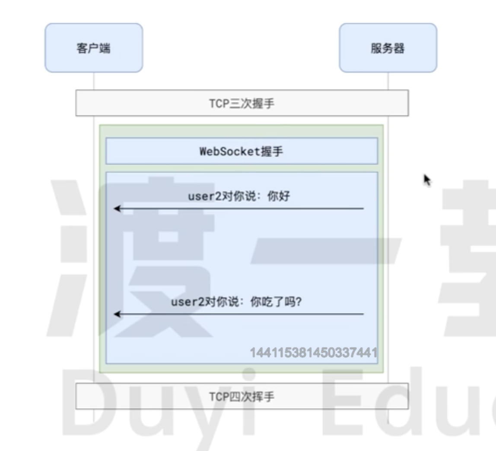

# WebSocket

## 简介



- `WebSocket` 是基于`TCP协议`之上,利用的是`TCP协议`全双工通信的能力。
- 在`WebSocket`中`客户端`和`浏览器`只需要完成一次` HTTP 握手`, 服务端就能一直与客户端保持通讯，直到关闭连接。

## 旧方案

### 短轮询

- `客户端`定时向`服务器`发送请求，以检查是否有新的数据。
- 请求返回后，`客户端`会再次发起请求。
- 适用于更新不频繁的场景。
- 可能导致不必要的网络流量和延迟，因为请求间隔可能不总是能精确匹配数据更新的频率。

### 长轮询

- `客户端`向`服务器`发送请求，`服务器`在有新数据或超时之前**不会立即响应**。
- 当有新数据时，服务器返回响应，`客户端`再发送**新请求**。
- 适用于需要实时更新的场景，如`聊天应用`或`实时通知`。
- 可以减少`请求次数`, 但是服务端编写比较复杂。

## WebSocket 握手

### 客户端发起请求

客户端通过 **HTTP** 发起 **WebSocket 握手** 请求,使用`Upgrade`头部将协议升级到**WebSocket**

```javascript
GET /chat HTTP/1.1
Host: example.com
Upgrade: websocket
Connection: Upgrade
Sec-WebSocket-Key: dGhlIHNhbXBsZSBub25jZQ==
Sec-WebSocket-Version: 13
```

- `Upgrade`和`Connection`头部用于告诉`服务器`,`客户端`希望升级协议。
- `Sec-WebSocket-Key` 是一个随机生成的 Base64 编码字符串，用于生成响应的 `Sec-WebSocket-Accept`。
- `Sec-WebSocket-Version` 表示 `WebSocket` 的协议版本。

### 服务端响应

`服务器`接受升级请求并回应`客户端`

```javascript
HTTP/1.1 101 Switching Protocols
Upgrade: websocket
Connection: Upgrade
Sec-WebSocket-Accept: <calculated-response-key>
```

- `101 Switching Protocols` 状态码表示协议已成功升级。
- `Sec-WebSocket-Accept` 是服务器基于客户端提供的 `Sec-WebSocket-Key` 计算得出的值。

### 建立连接

一旦握手成功，`客户端`和`服务器`之间建立了持久的 `WebSocket 连接`，可以进行全双工通信。
