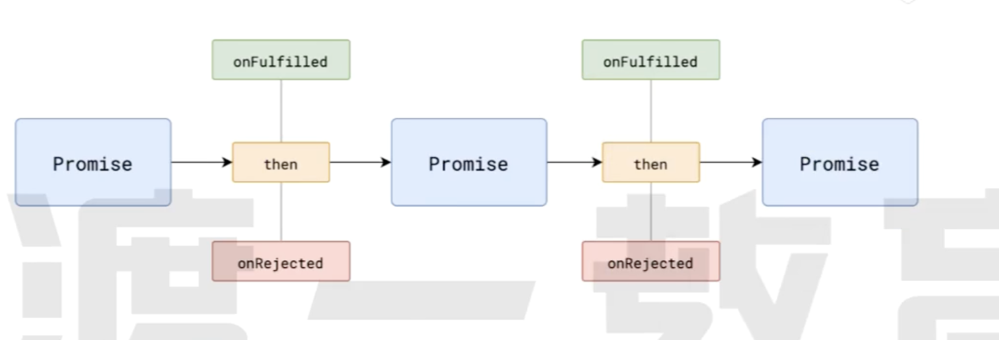

# Promise API

## then 方法

`Promise` 实例的 then 方法最多接受两个参数:

```javascript
Promise.prototype.then(onFulfilled, onRejected);
```

- 用于 `Promise`到 **完成状态(fulfilled)** 和 **失败状态(rejected)** 情况的回调函数。
- 当 `Promise` 的状态是 **完成状态(fulfilled)**的时候 会调用 `then` 方法里面的 `onFulfilled`
- 当 `Promise` 的状态是 **失败状态(rejected)**的时候 会调用 `then` 方法里面的 `onRejected`
- then 方法会返回一个全新的 Promise 对象,可以用于链式调用

## catch 方法

```javascript
Promise.prototype.then(undefined, onRejected);
```

- 当 `Promise` 的状态是 **失败状态(rejected)**的时候 会调用 `then` 方法里面的 `onRejected`
- 实际上 `catch` 方法是 `Promise.prototype.then(undefined, onRejected)` 的一种简写形式。
- Promise 对象的错误具有冒泡性质 会一直向后传递 直到被 `catch` 方法和 `onRejected` 捕获
- 一般来说不要在 `then` 方法中定义 `onReject` 的回调函数 而是应该总是使用 catch 方法，这样更接近于同步的写法（try...catch）。

## 链式调用



- `then` 方法必定会返回一个新的 Promise 对象, 可以理解为后续处理也是一个任务

- 新任务的状态取决于后续处理:

  - 若没有相关的数据处理 新任务的状态和前任务一致 数据为前一个任务的数据

    ```javascript
    const promise = new Promise((resolve, reject) => {
      console.log("promise 执行了");
      reject();
    });

    const promise1 = promise.then(() => {
      console.log("promise1 执行了");
    });

    setTimeout(() => {
      console.log(promise1);
      // 因为 第一个 new Promise() 执行了reject之后 promise状态变成了 rejected
      // promise1 没有对 promise的reject进行处理 所以promise1的状态仍然还是 rejected
    }, 0);
    ```

    ```javascript
    const promise = new Promise((resolve, reject) => {
      console.log("promise 执行了");
      resolve();
    });

    const promise1 = promise.catch(() => {
      console.log("promise1 执行了");
    });

    setTimeout(() => {
      console.log(promise1);
      // 因为 第一个 new Promise() 执行了resolve之后 promise状态变成了 fulfilled
      // promise1 没有对 promise的resolve进行处理 所以promise1的状态仍然还是 fulfilled
    }, 0);
    ```

  - 若有后续任务处理但是还未执行 新的任务挂起

    ```javascript
    const promise = new Promise((resolve, reject) => {
      console.log("学习");
      setTimeout(() => {
        resolve();
      }, 2000);
    });

    const promise1 = promise.then(() => {
      console.log("考试");
    });

    setTimeout(() => {
      console.log(promise1);
      // 因为 第一个 new Promise() 需要等到两秒才执行resolve
      //  延迟一秒钟打印promise1 的时候 promise1 还处于挂起状态(pending)
    }, 1000);
    ```

  - 若后续任务处理执行了，则后续处理的情况确定新任务的状态

    - 如果后续处理执行成功,新任务的状态为完成,数据为后续处理的返回值

      ```javascript
      const promise = new Promise((resolve, reject) => {
        console.log("我在考试");
        resolve();
      });

      const promise1 = promise.then(() => {
        return 100;
      });

      setTimeout(() => {
        console.log(promise1);
        //  100
      }, 1000);
      ```

    - 如果后续处理执行错误,新任务的状态为失败,数据为异常对象

      ```javascript
      const promise = new Promise((resolve, reject) => {
        reject(new Error("error"));
      });

      const promise1 = promise.catch(() => {
        throw new Error("new error"); // 抛出一个错误
      });

      setTimeout(() => {
        console.log(promise1);
        //  new error 的错误信息
      }, 1000);
      ```

    - 后续执行后返回的是一个 Promise 对象, 新任务的任务状态和数据与该 Promise 对象一致

      ```javascript
      const promise = new Promise((resolve, reject) => {
        reject(new Error("error"));
      });

      const promise1 = promise
        .catch(() => {
          return new Promise(function (resolve, reject) {
            resolve("fun");
          });
        })
        .then((value) => {
          console.log(value);
        });

      setTimeout(() => {
        console.log(promise1);
        // fun
      }, 1000);
      ```
