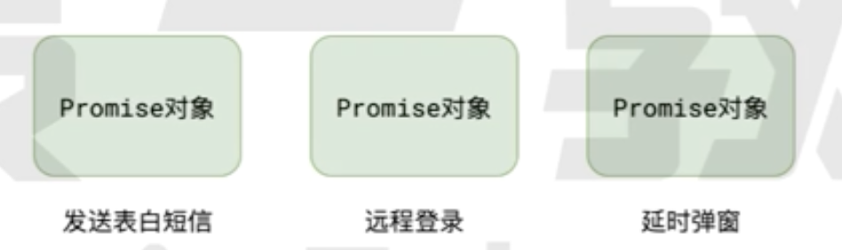
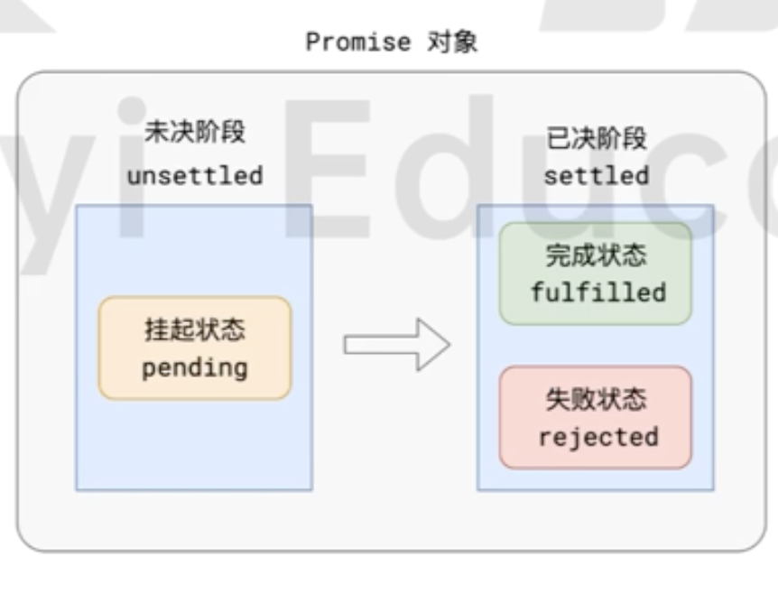
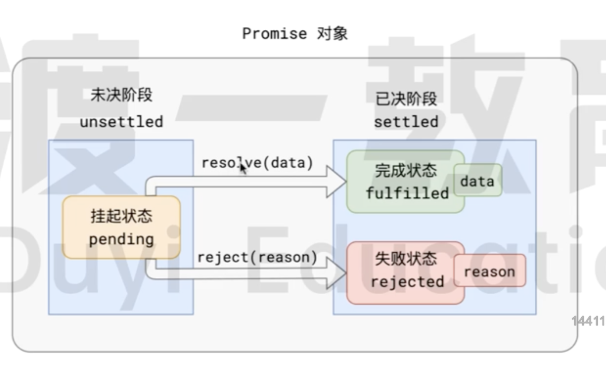
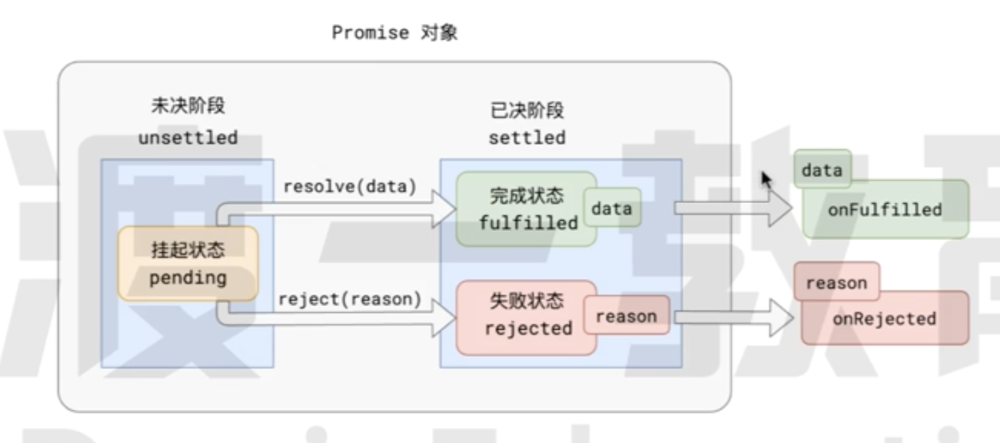

# Promise

Promise 是一套专门处理异步场景的规范,它能有效避免回调地狱的产生，使异步代码更加清晰、简洁、统一。

这套规范最早诞生于前端社区 规范名称为 `Promise A+`

## Promise A+ 规范:

- 所有的异步任务,都可以看作是一个异步任务,每个异步任务,在 JS 应该表现为一个**对象** 该对象之前称为 **Promise 对象**
  也叫做任务对象

- 每个任务对象 都应该有两个阶段三个状态
  

  根据常理 它们之间存在以下逻辑

  - 任务总是从**未决阶段(unsettled)** 变成 **已决阶段(settled)** 无法逆行
  - 任务总是从 **挂起状态(pending)** 变到**完成状态(fulfilled)**或**失败状态(rejected)**
  - 事件不能倒流，历史不能被改写 任务一旦变成**已决阶段(settled)** 状态就被固定下来 无法被改变

- 当调用 `resolve` 的时候任务状态就会从 **挂起状态(pending)**变到 **完成状态(fulfilled)**
- 当调用 `reject` 的时候任务状态就会从 **挂起状态(pending)**变到 **完成状态(rejected)**
- 任务完成的时候可能有一个相关的数据 任务失败的时候 可能会有一个相关原因
  

- 针对任务可以进行后续处理 针对完成状态的后续处理称之为 `onFulfilled` 针对失败状态的后续处理称之为 `onRejected`
  
