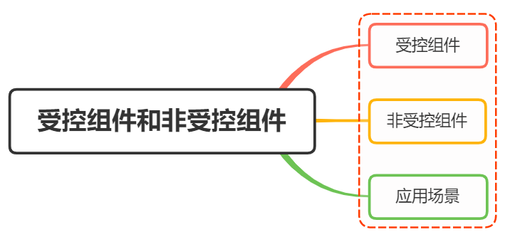

# 受控组件和非受控组件



## 受控组件

组件的使用者，有能力完全控制该组件的行为和内容。组件的状态全程响应外部数据

举个简单的例子：

```jsx
class ControllComponent extends React.Component {
  constructor(props) {
    super(props);
    this.state = { username: "lindaidai" };
  }
  render() {
    return <input name="username" value={this.state.username} />;
  }
}
```

这时候当我们在输入框输入内容的时候，会发现输入的内容并无法显示出来，也就是 input 标签是一个可读的状态

这是因为 `value` 被 `this.state.username` 所控制住。当用户输入新的内容时，`this.state.username` 并不会自动更新，这样的话 `input` 内的内容也就不会变了

如果想要解除被控制，可以为 `input` 标签设置 `onChange` 事件，输入的时候触发事件函数，在函数内部实现 state 的更新，从而导致 input 框的内容页发现改变

因此，受控组件我们一般需要初始状态和一个状态更新事件函数

#

## 非受控组件

组件的使用者 可以不用控制该组件的行为和内容 一般情况是在初始化的时候接受外部数据，然后自己在内部存储其自身状态
当需要时，可以使用 ref 查询 DOM 并查找其当前值

```jsx
import React, { Component } from "react";

export class UnControll extends Component {
  constructor(props) {
    super(props);
    this.inputRef = React.createRef();
  }
  handleSubmit = (e) => {
    console.log("我们可以获得input内的值为", this.inputRef.current.value);
    e.preventDefault();
  };
  render() {
    return (
      <form onSubmit={(e) => this.handleSubmit(e)}>
        <input defaultValue="lindaidai" ref={this.inputRef} />
        <input type="submit" value="提交" />
      </form>
    );
  }
}
```
