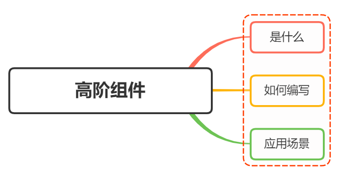

# 高阶组件



## 什么是高阶组件？

什么是高阶函数(HigherOrderFunction)？

- 接受一个或多个函数作为输入
- 输出一个函数

在 `React` 中，高阶组件即接受一个或多个组件作为参数并且返回一个组件，本质也就是一个函数，并不是一个组件

```typescript showLineNumbers
const EnhancedComponent = highOrderComponent(WrappedComponent);
```

上述代码中，该函数接受一个组件 `WrappedComponent` 作为参数，返回加工过的新组件 `EnhancedComponent`

## 如何编写高阶组件？

最基本的高阶组件的编写模板如下：

```typescript showLineNumbers
import React, { Component } from "react";
export default (WrappedComponent) => {
  return class EnhancedComponent extends Component {
    // do something
    render() {
      return <WrappedComponent />;
    }
  };
};
```

通过对传入的原始组件 `WrappedComponent` 做一些你想要的操作（比如操作 props，提取 state，
给原始组件包裹其他元素等），从而加工/增强出想要的组件 `EnhancedComponent`

所以我们可以把一些通用的逻辑放在高阶组件中。对组件进行统一的处理 从而实现代码的可复用性

### 使用高阶组件的约定

- props 保持一致
- 如果在函数式（无状态）组件上使用 `ref` 属性，需要用到 `React.forwardRef` 因为函数式组件没有实例
- 不要以任何方式改变原始组件 `WrappedComponent`
- 透传不相关 props 属性给被包裹的组件 `WrappedComponent`
- 不要再 render() 方法中使用高阶组件
- 使用 compose 组合高阶组件
- 包装显示名字以便于调试
