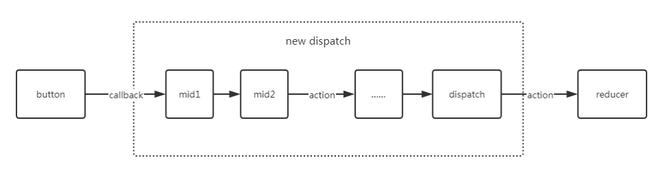

# applyMiddleware

## 什么是 Redux Middleware

`Redux Middleware` 是一种可插拔的机制，用于在 `Redux` 的 `dispatch` 函数被调用后 `reducer` 处理 `action` 之前 对 `action` 进行拦截、
变化、增强等操作 `Redux middleware`可以用于很多场景，例如：

- 异步操作：`Redux` 本身是同步的，但是我们可以使用 `middleware` 来处理异步操作，例如发起网络请求，等待数据返回后再更新 `store`;
- 日志：用于记录每个 `action` 的执行过程，以便于调试和分析；
- 认证和授权：可以拦截所有 `action`，然后进行认证和授权，以确保只有授权用户可以执行某些操作。

`middleware` 简化后的核心逻辑如下

```javascript
const middleware = (store) => {
  return (next) => {
    return (action) => {
      /**
       * 在action被dispth之前做一些事情
       */
      const result = next(action);

      /**
       * 在action被dispth之后做一些事情
       */
      return result;
    };
  };
};
```

通过以上代码不难看出 `middleware` 本质上是就是一个接受 `store`、 `next`、`action` 三个参数的函数 其中，
`store` 是 `Redux` 的 `store` 对象，`next` 是 `dispatch` 函数，`action` 是当前的 `action` 对象。



## 使用 applyMiddleware

在 `Redux` 中使用 `middleware` 非常简单，只需要在创建 `store` 的时候使用 `applyMiddleware` 函数将 `middleware` 应用到 `store` 上即可

```ts title='./middleware.tsx'
export const middleware1 = (store) => {
  return (next) => {
    return (action) => {
      console.log("will dispatch--1--next, action:", next, action);

      // Call the next dispatch method in the middleware chain.
      const returnValue = next(action);

      console.log("state after dispatch--1", store.getState());

      // This will likely be the action itself, unless
      // a middleware further in chain changed it.
      return returnValue;
    };
  };
};

export const middleware2 = (store) => {
  return (next) => {
    return (action) => {
      console.log("will dispatch--2--next, action:", next, action);

      // Call the next dispatch method in the middleware chain.
      const returnValue = next(action);

      console.log("state after dispatch--2", store.getState());

      // This will likely be the action itself, unless
      // a middleware further in chain changed it.
      return returnValue;
    };
  };
};

export const middleware3 = (store) => {
  return (next) => {
    return (action) => {
      console.log("will dispatch--3--next, action:", next, action);

      // Call the next dispatch method in the middleware chain.
      const returnValue = next(action);

      console.log("state after dispatch--3", store.getState());

      // This will likely be the action itself, unless
      // a middleware further in chain changed it.
      return returnValue;
    };
  };
};
```

```ts title='./store.tsx'
import { createStore, applyMiddleware } from "redux";
import rootReducer from "./reducers";
import { middleware1, middleware2, middleware3 } from "./middleware";
const store = createStore(
  rootReducer,
  applyMiddleware(middleware1, middleware2, middleware3)
);
export default store;
```

在上面的代码中 我们使用了 `applyMiddleware` 函数将 `middleware1`，`middleware2`，`middleware3`应用到了 `store` 中
这样我们调用 `store.dispatch` 的时候 `middleware` 就会被依次执行，直到 `reducer` 处理 `action`.

## applyMiddleware 源码分析

`applyMiddleware` 源码如下

```ts title=middleware.ts
export default function applyMiddleware(...middlewares) {
  return (createStore) => {
    return (...args) => {
      const store = createStore(...args);
      let dispatch = () => {
        throw new Error(
          "Dispatching while constructing your middleware is not allowed. " +
            "Other middleware would not be applied to this dispatch."
        );
      };

      const middlewareAPI = {
        getState: store.getState,
        dispatch: (...args) => dispatch(...args),
      };
      const chain = middlewares.map((middleware) => middleware(middlewareAPI));
      dispatch = compose(...chain)(store.dispatch);

      return {
        ...store,
        dispatch,
      };
    };
  };
}
```

主要做了以下几件事情：

- 先使用 `createStore` 创建 `store`
- 再执行 `middlewares.map` 为 每个中间件最外层函数提供 `getState` 和 `dispatch` 方法，
- 此时 `middlewares.map` 执行完过后 传入的中间件函数就变成了两层;

使用 `compose` 函数整理之后得到:

- 所以经过 `compose` 函数处理之后 中间件函数在 `redux` 内部执行顺序和 最开始的传入顺序反过来了

```javascript
const composeFunction = compose(middleware1, middleware2, middleware3);
// 会生成如下代码
composeFunction = (...args) => {
  return middleware1(middleware2(middleware3(...args)));
};
```

接下来传入初始的`store.dispatch` 整理之后得到:

- 所以 `dipatch` 的执行顺序是和 最开始的传入顺序一致的

```javascript
dispatch = composeFunction(store.dispatch);

// 会生成如下代码
dispatch = handleAction (action)=>{
    return handleAction2 (action)=>{
        return handleAction3 (action)=>{
            store.dispatch(action)
        }
    }
}
```

## 注意事项

### 编写中间件的注意点

```javascript
function mid1({ dispatch, getState }) {
  //1.使用 dispatch() 会触发错误
  return function fn1(next) {
    //2. 使用 dispatch() 会触发错误
    return function fn1Rf(action) {
      //3. 使用 dispatch() 会导致死循环
      next(action);
    };
  };
}
```

<b>原因：</b>

第一个和第二个原因如下：

`applyMiddleware` 中 `middlewareAPI` 中的 `dispatch` 指向的是 带有 `throw new Error()`的这个 `dispatch` 函数，
所以在组合中间件时使用 `dispatch` 就会抛出异常

```javascript
 export default function applyMiddleware(...middlewares){
   return (createStore) => (reducer, preloadedState) => {
     let dispatch = () => {
       throw new Error(
         'Dispatching while constructing your middleware is not allowed. ' +
           'Other middleware would not be applied to this dispatch.'
       )
     }
     const middlewareAPI = {
       getState: store.getState,
       dispatch: (action, ...args) => dispatch(action, ...args)
     }
 ​
     const chain = middlewares.map(middleware => middleware(middlewareAPI))
     dispatch = compose(...chain)(store.dispatch)
   }
 }
```

第三个原因:

```javascript
dispatch = compose(...chain)(store.dispatch);
```

<b>结果如下:</b>

```javascript
// 暂时命名为 mark
dispatch = function fn1Rf(action) {
  // 此时按照第三个错误原因在这执行 dispatch(), 这个dispatch指向的是mark, 所以会导致，无限重新执行fn1Rf
  // dispatch() , 死循环
  return function fn2Rf(action) {
    return function fn3Rf(action) {
      // 这个 storeDispatch 是 compose(...chain)(store.dispatch) 是传入的 store.dispatch
      // 避免混淆，使用 storeDispatch 命名， 源码中就是到 dispatch(action)
      return storeDispatch(action);
    };
  };
};
```
