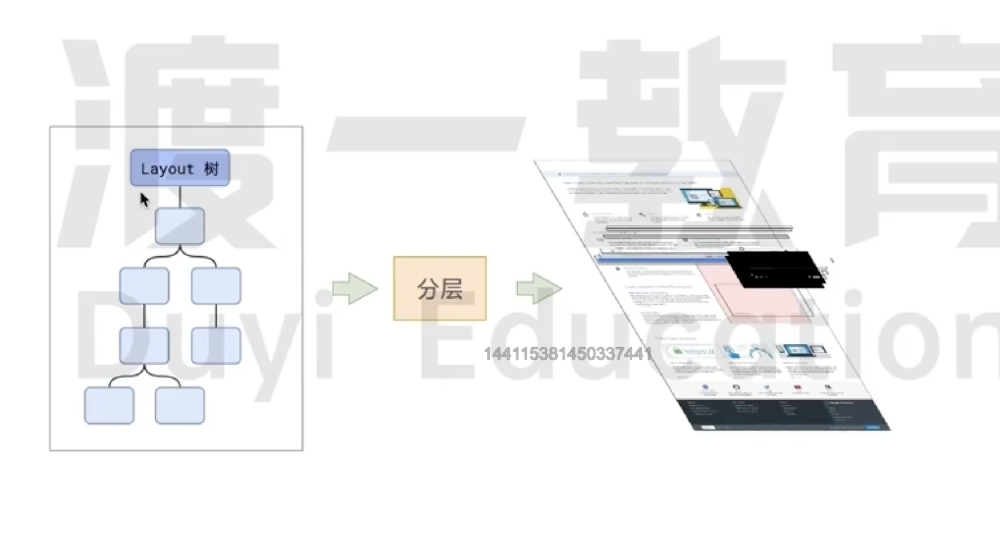

# 分层

当浏览器进行渲染时，分层`(Layer)`是指将网页内容按照不同的层次进行组织和渲染，这一技术可以提高页面渲染的性能和用户体验。

在现代浏览器中，通常会对页面进行如下几种分层：

- **文档层 (Document Layer)**:

  - 文档层是页面的基本结构，即 HTML 文档本身。
  - 这一层包含了页面的主要内容，如文本、图像等

- **CSS 层 (CSS Layer)**:

  - CSS 层包含了应用在文档层上的所有样式信息。
  - 这些样式可以是通过外部 CSS 文件或者内部样式表（`<style>`标签）定义的。

- **图层 (Paint Layer)**:

  - 图层包含了将页面内容渲染成位图`(Bitmap)`的信息。
  - 这些位图可以由浏览器根据文档层和 `CSS 层`的内容来生成

- **合成层 (CSS Layer)**:

  - 合成层将不同的图层合成为最终的视觉输出。
  - 浏览器可以利用硬件加速来加快合成层的处理速度，提高页面的渲染效率和流畅度

分层渲染的优势在于可以更高效地处理复杂的页面结构和动画效果。

通过将页面分解为多个层，浏览器可以只重新绘制发生变化的层，而不是整个页面，从而减少了渲染的计算量，提升了页面的响应速度和流畅度。

同时`滚动条,堆叠上下文,transform,opacity` 等样式都会或多或少的影响分层的结果，也可以通过**`will-change`**属性更大程度影响分层结果。
