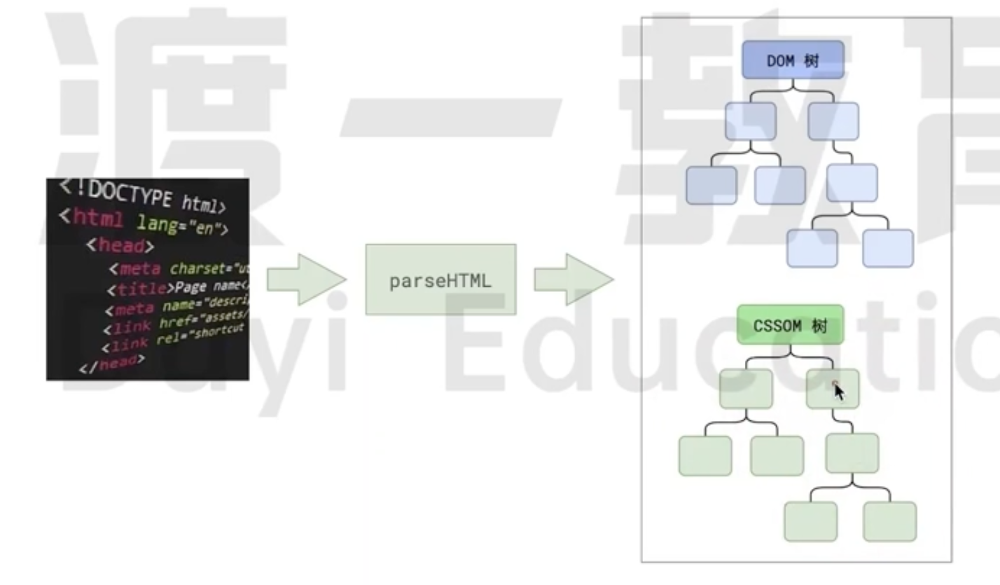
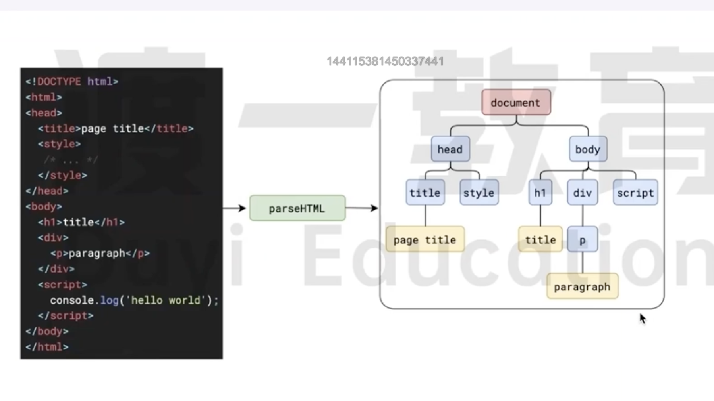
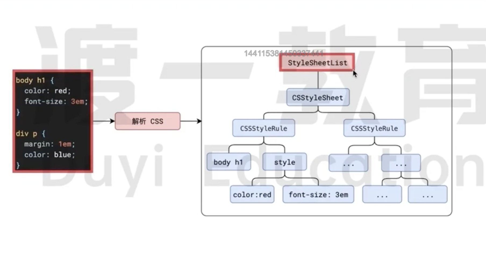
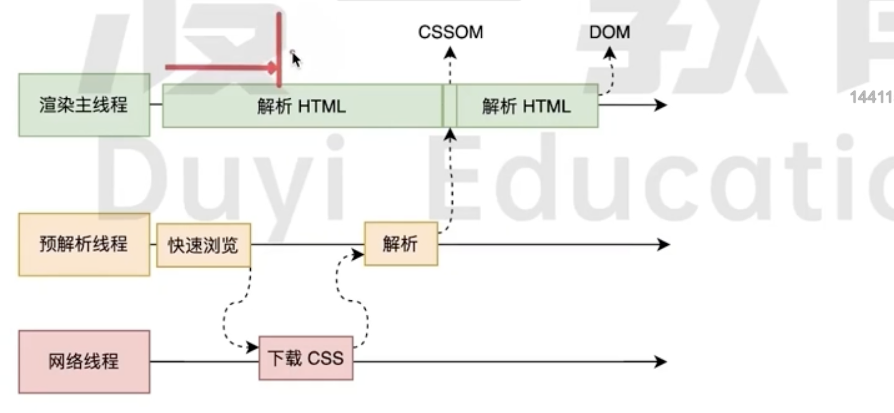

# HTML 解析

当浏览器的网络线程收到 `HTML` 文档之后,会产生一个渲染任务。传递给浏览器的渲染主线程。

首先会把 HTML 字符串构建成 `DOM树`和`CSSOM树`。

可以让后续的步骤不在操作字符串，只操作 `DOM 树`和 `CSSOM 树`，为后续的渲染步骤做准备。

## DOM 树

`DOM(文档对象模型)` 树是指在网页中，HTML 文档的结构化的表示方式。

它由节点(node)构成，这些节点以树形结构组织起来，每个节点代表文档中的一个元素、属性或者文本。
在浏览器中加载 HTML 页面时，浏览器会解析 HTML 代码并将其转换为 `DOM 树`的形式。

具体来说，`DOM 树`包括以下几个重要的概念和组成部分：

- **根节点(Root Node)**

  整个文档的根节点，通常是 `<html/>` 元素。

- **节点(Node)**

  `DOM 树`中的基本单位，可以是元素节点、文本节点、注释节点等。每个 HTML 元素、属性或者文本内容都是一个节点。

- **元素节点(Element Node)**

  HTML 中的标签(如 `
、
` 等)以及它们的属性会被解析为元素节点。

- **文本节点(Text Node)**

  HTML 中的文本内容会被解析为文本节点，如段落中的文字。

- **属性节点(Attribute Node)**

  HTML 元素的属性会被解析为属性节点，如 `
` 中的 id 属性。

- **父节点(Parent Node)** 和 子节点(Child Node)

  `DOM 树`中的节点可以相互包含和嵌套，一个节点可以有一个或多个子节点，也可以有一个父节点。

`DOM 树`的结构反映了 HTML 文档的层级关系和结构。`JavaScript` 可以通过操作 DOM 树来动态修改页面内容、样式和结构，从而实现动态交互效果和响应用户操作。

## CSSOM 树

`CSSOM(CSS Object Model)`树是与 `DOM 树`类似的概念，但它代表的是 CSS 样式表的层级结构和信息。

- **StyleSheetList**

  表示是`CSSOM 树`的根节点。 是一个表示文档中所有样式表集合的对象。它是一个只读的类数组对象，包含了文档中所有样式表。

- **CSSStyleSheet**

  表示一个 `CSS 样式表`对象,提供了特定于 `CSS 样式表`的属性和方法。

  其中 `CSS 样式表`包含以下几种类型：

  - 内部样式表：在 HTML 文档中使用 `<style>` 元素定义的样式表。
  - 外部样式表：通过 `<link rel="stylesheet">` 链接的 CSS 文件。
  - 内联样式表：在 HTML 文档中使用 `

` 元素定义的样式表。
  - 浏览器默认样式表

- **CSSStyleRule**

  是一个表示 `CSS 规则`的接口，它用于描述样式表中的具体规则或选择器,开发人员可以以编程方式管理和操作页面中的 `CSS 样式规则`，从而实现更加动态和灵活的页面样式控制。

## 解析规则

### HTML 解析过程中遇到 CSS 怎么办？

为了提高解析效率,浏览器会启动一个`预解析线程`率先`下载`和 `解析 CSS`，所以`CSS`不会阻塞 HTML 解析的步骤

### HTML 解析过程中遇到 `<script>`或者 `JS 代码` 怎么办？

浏览器解析到`<script>`的时候，会根据这个`<script>`元素的`async`和 `defer`属性。判断解析 `JS 脚本` 的规则是同步还是异步/其他解析方式。

如果是同步的则会阻塞浏览器接下来的 `HTML 解析`步骤，

浏览器解析到 JS 代码的时候会暂停一切行为等待 JS 代码解析完成,因为 JS 脚本可能会修改当前的 `DOM 树`
