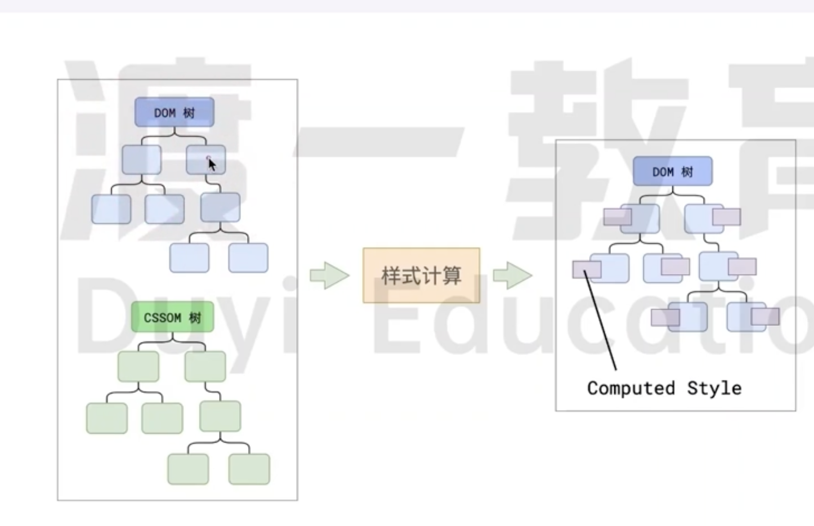

# 样式计算

样式计算 是指浏览器在渲染页面时将 `CSS 样式`应用于文档元素的过程。

这个过程涉及从各种样式源(如外部 `CSS 文件`、`内部样式块`、`行内样式`等)收集和计算出最终应用于每个元素的样式信息。

具体来说，样式计算包括以下几个关键步骤：

- **样式收集和联合**：浏览器会收集所有适用于文档的样式信息，包括外部 CSS 文件(通过 `<link>` 标签引入)、内部样式(`<style> `标签中定义的样式)、行内样式(直接写在 HTML 元素的 style 属性中)、用户代理样式表(浏览器默认样式)等。

- **选择器匹配**:浏览器根据文档对象模型(DOM)和 CSS 对象模型(CSSOM)中的元素以及它们的层叠样式表(CSS 规则)来匹配适合的 CSS 选择器。这个过程确定了哪些规则适用于哪些元素。

- **计算样式值**：一旦确定了适用于每个元素的 `CSS 规则`，浏览器开始计算每个样式属性的`最终值`。这包括继承值的计算(如果属性可以继承)、计算单位、解析颜色值等等。在这一过程中，很多预设值会变为绝对值。
  比如 `red` 会变成 `rgb(255,0,0)`,相对单位会变成绝对单位，比如 `em` 会变成 `px`

- **应用最终样式**：计算完成后，浏览器将最终的样式信息应用到每个元素上。这个过程将确定元素的外观和布局，影响视觉渲染的结果。
