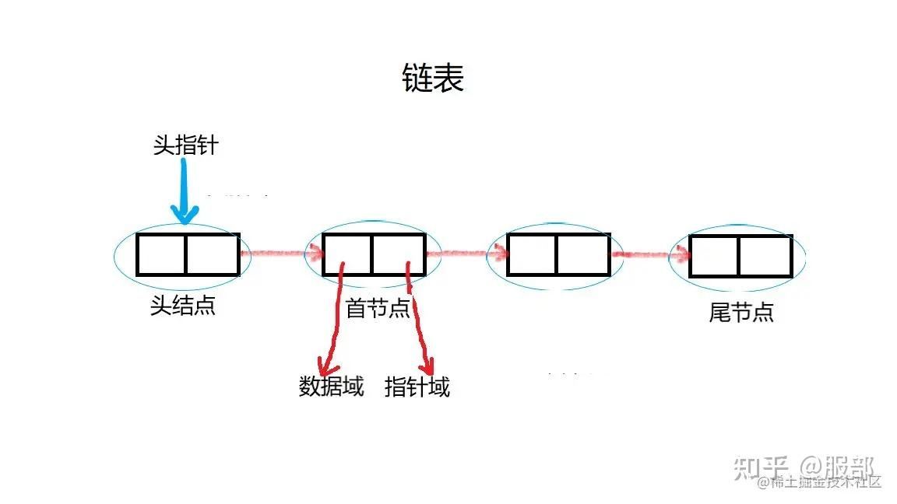

# 链表



## 概述

链表是什么？

- 链表是一种线性数据结构。
- 是多个元素组成的列表 元素存储不联续 用 `next`指针连接在一起。

## 数组和链表的区别

- 数组: 增删非首尾元素时往往需要移动元素
- 链表: 增删非首尾元素 不需要移动元素 只需要更改 `next` 的指向。

## Javascript 实现链表

### 定义链表节点类(Node)

```typescript
class Node<T> {
  constructor(public value: T, public next?: Node<T>) {}
}

export default Node;
```

### 创建链表类(LinkList)

```typescript
import Node from "./Node";
class LinkList<T> {
  private head: Node<T> | null = null;

  private length: number = 0;

  constructor() {}

  /**
   * 添加链表内容
   * @param value
   */
  public add(value: T) {
    const newNode = new Node(value);
    if (!this.head) {
      this.head = newNode;
    } else {
      // 一直找到最后一个为空的节点
      let current = this.head;
      while (current.next) {
        current = current.next;
      }

      // 将最后一个节点的next指向新节点
      current.next = newNode;
    }

    this.length++;
  }

  /**
   * 查找链表对应的内容
   * @param value
   * @returns
   */
  public find(value: T) {
    let current = this.head;

    while (current) {
      if (current.value === value) {
        return current;
      }
      current = current.next;
    }

    return current;
  }

  /**
   * 删除链表第一个匹配的内容
   * @param value
   */
  public remove(value: T) {
    if (!this.head) {
      return this.head;
    }

    // 如果是头部的节点 直接指向下一个节点
    if (this.head.value === value) {
      this.head = this.head.next;
      this.length--;
      return;
    }

    let current = this.head;

    while (current.next) {
      if (current.next.value === value) {
        current.next = current.next?.next;
        this.length--;
        return;
      }
      current = current.next;
    }
  }

  /**
   * 插入到某个元素之后
   * @param value
   */
  public insertAfter(value: T, targetNode: T) {
    let current = this.head;

    while (current) {
      if (current.value === targetNode) {
        const newNode = new Node(value);
        newNode.next = current.next;
        current.next = newNode;
        this.length++;
        return;
      }
      current = current.next;
    }
  }

  public forEach(callback: (value: T, node: Node<T>) => void) {
    let current = this.head;
    while (current) {
      callback(current.value, current);
      current = current.next;
    }
  }

  *[Symbol.iterator]() {
    let current = this.head;
    while (current) {
      yield current;
      current = current.next;
    }
  }
}

export default LinkList;
```

### 合并两个有序链表

```typescript
const nodeList1 = new Node(1, new Node(2, new Node(4)));

const nodeList2 = new Node(2, new Node(3, new Node(4)));

const mergeTwoList = (list1?: Node<number>, list2?: Node<number>) => {
  if (!list1) {
    return list2;
  }
  if (!list2) {
    return list1;
  }

  if (list1.value < list2.value) {
    list1.next = mergeTwoList(list1.next, list2);
    return list1;
  } else {
    list2.next = mergeTwoList(list1, list2.next);
    return list2;
  }
};

console.log(mergeTwoList(nodeList1, nodeList2));
```
