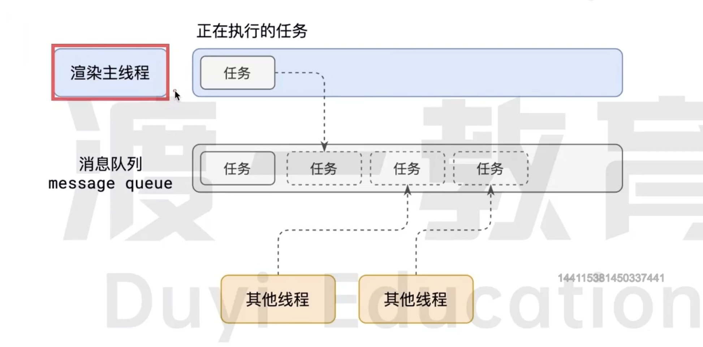

# 渲染主线程是如何工作的

渲染主线程是浏览器中最繁忙的线程 他需要处理的任务任务包括但不限于

- 解析 HTML
- 解析 CSS
- 计算样式
- 布局
- 处理图层
- 每秒把页面画 60 次
- 执行全局 JS 代码
- 执行事件处理函数
- 执行计时器的回调函数

TODO : 为什么浏览器的渲染主进程不开启多个线程来处理这个任务?

要处理这么多的任务 主线程遇到了一个前所未有的难题:如何调度任务

比如:

- 主线程正在执行一个 JS 函数 执行到一半用户点击了按钮 我应该去立即执行点击事件的处理函数吗？
- 主线程正在执行一个 JS 函数 执行到一半某个计时器到达了时间 我应该立即执行他的回调吗？
- 浏览器进程同时渲染主线程用户点击了按钮 与此同时 某个计时器也到达了时间 应该处理哪一个？

浏览器渲染主线程想到了一个绝妙的主意来解决这个问题:排队

- 在最开始的时候 渲染主线程会进入到一个无限循环
- 每一次循环都会检查 `message queue(消息队列)` 是否还有任务存在 如果有就会取第一个任务 交给渲染主线程执行 如果没有就会进行休眠状态
- 其他所有线程 可以随时向 `message queue(消息队列)` 添加任务,新的任务会加入到`message queue(消息队列)`的末尾 在添加的时候 如果渲染主线程处于休眠的状态
  则会将其唤醒继续循环拿任务
