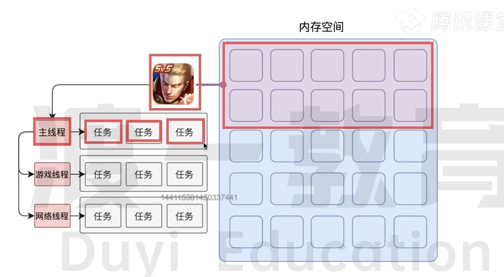

# 进程和线程

## 什么是进程

每个程序运行都需要开辟一块`内存空间`供程序使用 (比如微信,王者荣耀,QQ) 可以简单把这块内存空间理解为`进程`

所以每个程序至少有一个进程 进程之间互不干扰的 即使需要通讯也需要双方同意

## 什么是线程

有了进程之后 就可以运行程序运行的代码了 一个进程至少有一个线程 所以进程开启之后就会自动创建一个线程 这个线程称作为主线程

如果程序需要同时执行多块代码 主线程就会启动更多的线程来执行代码 所以一个进程可以包含多个线程

## 浏览器的进程和线程

`浏览器是一个多进程和一个多线程的应用程序`

浏览器内部极其复杂 为了防止避免互相影响 减少连环崩溃的几率 所以浏览器在启动的时候 主要会开启三个进程

### 浏览器进程

主要负责界面展示、用户交互、子进程管理等 浏览器进程内部会启动多个线程处理不同的任务

### 网络进程

负责加载网络资、网络进程内部会启动多个线程来处理不同的网络任务

### 渲染进程

渲染进程启动后 会开启一个渲染主进程 主线程主要负责解析和执行 HTML,JS,CSS
默认情况下 浏览器会为多个标签页开启一个新的渲染进程 以保证不同的标签之间 互不影响
