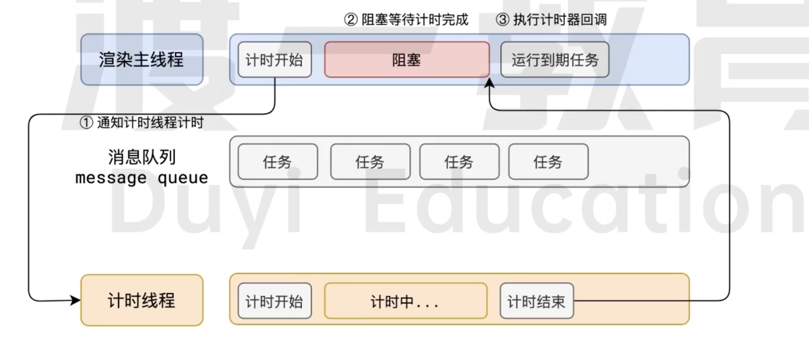
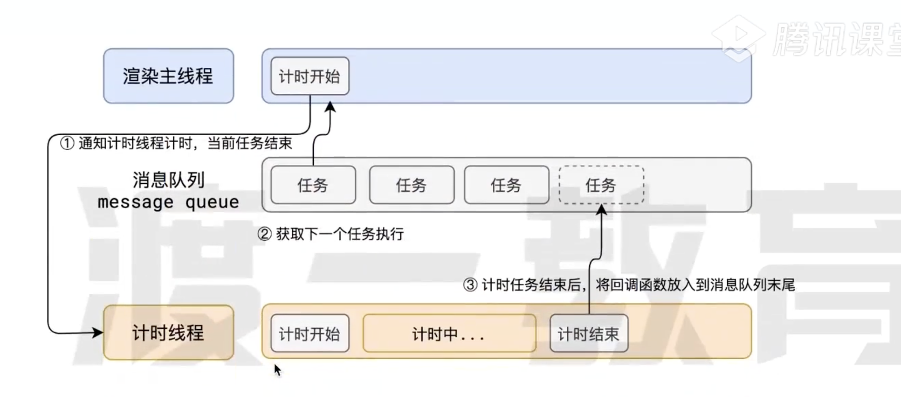

# 异步

## 什么是异步

代码在执行的时候 会遇到一些无法立即处理的任务

比如:

- 计时完成需要执行的任务 -- `setTimeout` `setInterval`
- 网络通信完成之后需要执行的任务 -- `XHR` `Fetch`
- 用户操作完成需要执行的任务 -- `addEventListener`

如果让渲染主线程等待这些任务的时机达到 , 就会导致主线程长期处于【阻塞】的状态 , 从而导致浏览器卡死

**渲染主线程 承担着极其重要的工作 无论如何都不能阻塞**

所以浏览器选择异步来解决这个问题

使用异步的方式 **可以使浏览器主线程 永不阻塞**

## 如何理解 JS 的异步

:::tip
JS 是一门单线程的语言 , 这是因为它在浏览器渲染主线程中,而渲染主线程只有一个。而渲染主线程承担着诸多的工作 渲染页面, 执行 JS 都在其中执行。

如果使用同步的方式 极有可能就会造成主线程阻塞 从而导致消息队列里面的其他任务没有得到执行 导致浏览器的页面无法得到及时更新 造成浏览器卡死的现象.

所以浏览器采用异步的方式来避免这种问题 当计时器 网络、事件监听、主线程会将这些任务交给其他线程去处理 自身立即结束任务的执行 转而去执行后续的代码。

当其他线程完成的时候就会把事先传递好的回调函数放在消息队列的末尾 等待主线程调度执行
:::
