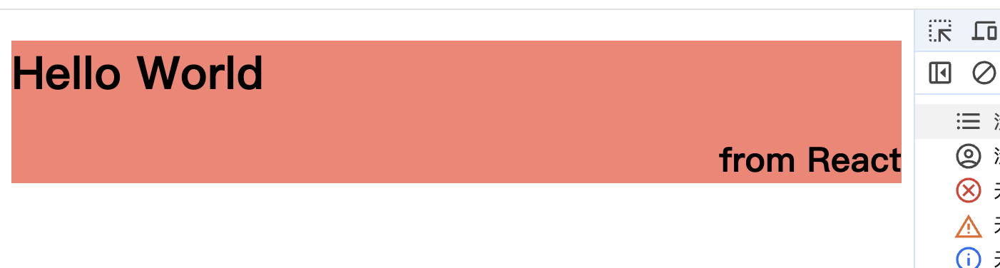

import fiber2 from "./images/fiber2.png";

# Fiber

:::info

- 实现 ReactDOM.render 函数
- 介绍 Concurrent Mode
- 介绍 Fiber
  :::

## 实现 render 函数

接下来我们需要自己实现一个 `render` 函数，并将其插入到指定的容器中。

目前，我们只关心向 DOM 添加内容。我们稍后会处理更新和删除。

假设 `jsx` 转换结果如下:

```javascript
const element = {
  type: "div",
  props: {
    style: "background: salmon",
    children: [
      {
        type: "h1",
        props: {
          children: "Hello World",
        },
      },
      {
        type: "h2",
        props: {
          style: "text-align: right",
          children: "from React",
        },
      },
    ],
  },
};

const render = (element, container) => {
  const dom = document.createElement(element.type);

  Object.keys(element.props).forEach((name) => {
    if (name === "children" && typeof element.props[name] === "string") {
      dom.innerText = element.props[name];
    } else {
      dom[name] = element.props[name];
    }
  });

  if (Array.isArray(element.props.children)) {
    element.props.children.forEach((child) => render(child, dom));
  }

  container.appendChild(dom);
};

render(element, document.getElementById("root"));
```



## Concurrent Mode

在开始添加更多代码之前,我们需要重构之前的 `render` 函数:

- 因为一旦开始渲染，我们就不会停止，直到渲染出完整的元素树。
- 如果元素树很大，可能会阻塞**主线程**太长时间。
- 如果浏览器需要执行高优先级的操作，例如处理用户输入或保持动画流畅，则必须等到`render` 函数执行完成。

所以,我们可以把工作分成小单元,完成每个单元后，如果还有其他需要完成的事情，我们将让浏览器中断渲染。

### 为什么使用 MessageChannel

React 主要使用宏任务来处理每轮单元的任务,但是为什么宏任务?

当执行一个`宏任务`时, 主线程的`JavaScript`代码会被 `暂时中断`，以便浏览器可以进行一些关键任务的处理比如：

- **更新 DOM :** 例如重新渲染页面、计算样式或触发布局变更等。
- **处理用户事件:** 例如用户点击、键盘输入、鼠标移动等事件。
- **运行动画或过渡效果:** 在这一期间，浏览器可以更新动画或页面过渡的渲染。

微任务(例如:Promise.then)执行的时候,主线程不会放弃对微任务的控制。

### 为什么不使用 setTimeout

- 现代浏览器认为嵌套过多的 setTimeout 调用超过五次就会阻塞，并将其最小延迟设置为 4ms, 因此不够精确。

### 为什么不使用 requestIdleCallback

- `requestIdleCallback`是一个实验性的 API,他在浏览器空闲的时候执行回调，而 `React` 需要根据组件优先级、更新的紧急程度等信息，更精确地安排渲染的工作。
- 兼容性不太好,尚未得到所有浏览器的支持。
- `requestIdleCallback` 的执行时机不是完全可控的，这可能导致在不同环境中表现不一致。

### 为什么不使用 Generator

- `Generator` 增加了很多语法开销，而且还增加了现有实现中的运行时开销。
- `Generator` 是有状态的。无法在其中途恢复。如果你要恢复递归现场，可能需要从头开始, 恢复到之前的调用栈。

## 介绍 Fiber

为了组织每个`工作单元(unit of work)`，我们需要一个数据结构：**Fiber**。

我们需要为每个元素创建一个**Fiber**,同样每个**Fiber**都是一个`工作单元(unit of work)`。

假设我们想要渲染一棵像这样的树, 渲染的 **Fiber** 树大致如下:

```mdx-code-block

<div style={{display:'flex',gap:30 }}>
  <div style={{
    width:275,
    height:'100%',
  }}>
```

```jsx
ReactDOM.render(
  <div>
    <h1>
      <p />
      <a />
    </h1>
    <h2 />
  </div>,
  container
);
```

```mdx-code-block
</div>

</div>
```

渲染过程中需要做的事情:

- 创建 **RootFiber** 并将其设置为 `nextUnitOfWork`
- 添加到元素到 `DOM 树`,给每个元素的子元素创建 **Fiber**。
- 每个 **Fiber** 都关联了 `子元素` , 下一个 `兄弟元素`, 和 `父元素`
- 当我们完成对**Fiber**的处理 如果它有一个 `子元素` 会变成下一个`工作单元`。
- 如果当前**Fiber** 没有 `子元素`, 会使用 `兄弟元素` 会变成下一个`工作单元`。
- 如果当前**Fiber**没有 `子元素` 或者 `兄弟元素` , 会使用`兄弟元素`的 `父元素` 会变成下一个`工作单元`。
